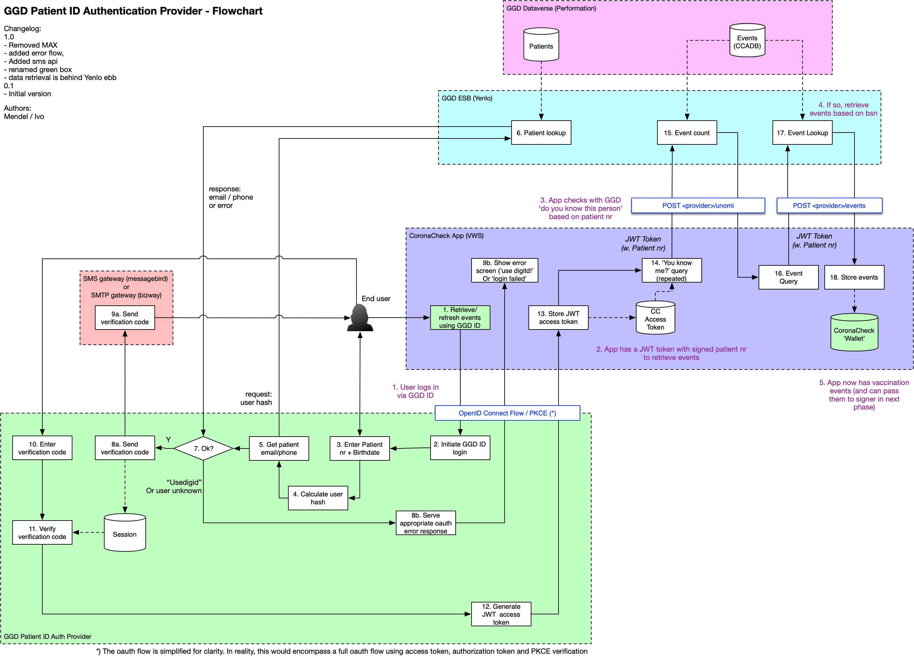
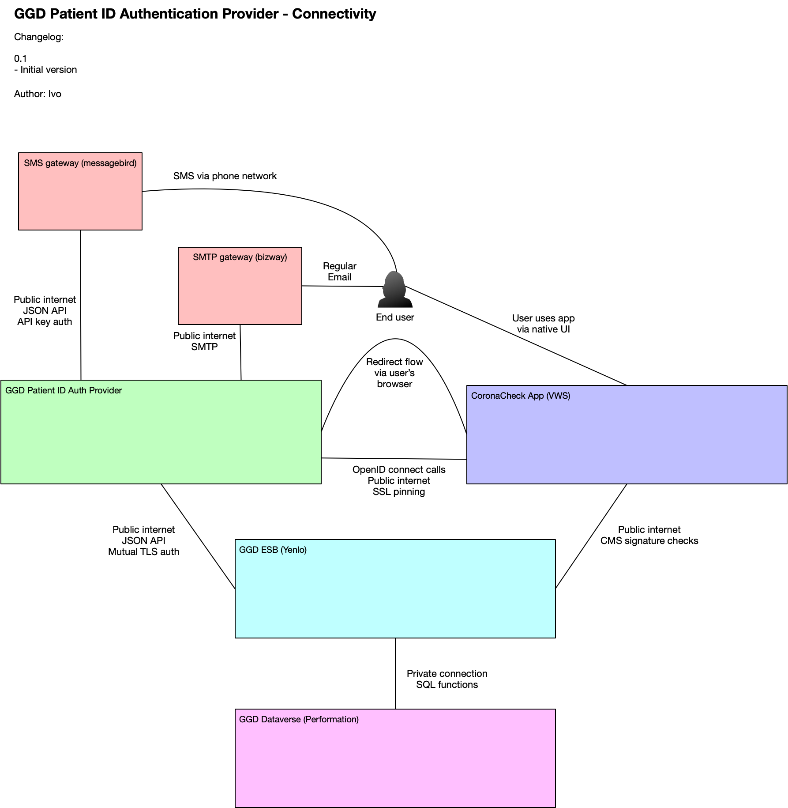

# GGD PatientID Authentication Provider

## Introduction

For users who do not have a BSN, CoronaCheck is not able to use DigiD login to retrieve a user's vaccination details. In order to still help users without BSN, an alternative backup solution is made available that does not rely on DigiD.

## High level description

The login alternative is based on a 'passwordless' authentication method that relies as much as possible on existing components and existing data, so that users who have already been vaccinated in the past can use the method without having to create any account or take any other actions than logging in.

To this end, the following flow has been designed:

1. The user enters their patient number (which is already communicated to them via vaccination appointment confirmation e-mails) and their birthdate.
2. If GGD has a matching patient record with this number and birthdate, the user receives a short-lived, one time verification code on their mobile device via SMS. 
3. If a phone number is not available but an e-mail is present, the verification code is sent by e-mail.
4. If the user enters the verification code correctly and within a specified time limit (5 minutes), then the user can retrieve their vaccination events (or covid test result events). 

## Systems involved

The following systems are involved in the GGD PatientID Authentication Provider:

* The CoronaCheck apps, these are used by the user to retrieve their details and generate a Digital Covid Certificate (DCC).
* The CoronaCheck website, used if the user wants to retrieve a paper version of the certificate. Since for the purposes of this feature the website and app are similar, we will only mention the apps in this document and its diagrams.
* The GGD 'dataverse', this is the unofficial name of the collection of database that the GGD has. For this feature we rely on the patient info in that database (birthdate, patientnumber, phonenumber, e-mail)
* The GGD ESB, which is middleware that exposes elements from the GGD dataverse tot the outside world.
* The GGD PatientID Authentication Provider, this is the component that implements this alternative login flow.

## Flow chart

The following flow chart depicts the full login and event retrieval flow. It also illustrates the way the involved systems are used.

## Connectivity

To build the system, several connections between components are necessary. The following diagram gives a high level overview of the connectivity between components.

For the connectivity between the authentication provider and the ESB a specific protocol is designed and documented. Detailed documentation of this protocol can be found here: [Providing Events By Patient-ID](https://github.com/minvws/nl-covid19-coronacheck-provider-docs/blob/main/docs/providing-events-by-patient-id.md)

## Requirements for GGD PatientID Account Provider

The following requirements for the GGD PAP component are defined:

1. The provider must expose the authentication flow via the OpenID connect protocol.
2. The OpenID connect protocol must implement PKCE, so that it can be used directly from native apps. (PKCE ensures that another app cannot highjack the return url and retrieve the access token).
3. The provider must retrieve the phonenumber or e-mail of the user from the GGD ESB via the protocol [documented here](https://github.com/minvws/nl-covid19-coronacheck-provider-docs/blob/main/docs/providing-events-by-patient-id.md)
4. If the patient id and birthdate do not exist, the user is provided with an error message telling them that the login failed. (They will be able to retry)
5. If the patient id and birthdate DO exist but the GGD also has a BSN for this user, the user is provided with an error message telling them that they can't use this login method and should use DigiD. This is done to reduce the number of people going through this alternative fallback login mechanism.
6. If the patient id and birthdate DO exist and GGD has no BSN for this user, the authentication provider must sent a verification code to the user.
7. If a cell-phone number is available for the user, the verification code MUST be sent by SMS. Even if there's also an e-mail known; rationale: sms is considered more secure than e-mail in this scenario.
8. If a cell-phone number is not available but an e-mail is available, the verification code can be sent by e-mail.
9. The system should offer the user to resend the verification code if they haven't retrieved it. This invalidates the previous verification code.
10. The access token is a signed JWT that contains the encrypted patient number and the user hash. (See the [protocol documentation](https://github.com/minvws/nl-covid19-coronacheck-provider-docs/blob/main/docs/providing-events-by-patient-id.md) for JWT detailed specifications)
11. Note that some people only have a year or a year plus month. The form entry must allow the user to add incomplete birthdates such as 'XX-XX-1976'.
12. If the user enters a wrong verification code, they can try again. This does not immediately send a new verification code. (This would confuse the user as to which code to enter).
13. The system should have adequate brute force protection such as, but not limited to, throttling or exponential back-off.
14. The patient number should be validated before the call to the ESB is made, to avoid spamming the ESB with nonsense requests. Due to the nature of the patient number however, this validation is fairly simple: they should be 1 to 8 numeric digits. Other validation is not currently possible.
15. The login form should be multilingual (Dutch/English). The apps must provide the currently selected language in the app, via the URL to the authentication provider.
16. Between the authentication provider and the ESB mutual TLS should be used so that only the official authentication provider can use the phonenumber lookup endpoint.

To be defined:

- Logging requirements? (SOC/abuse)
