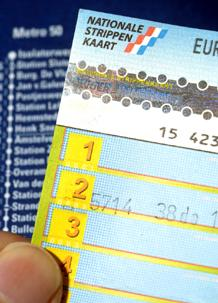
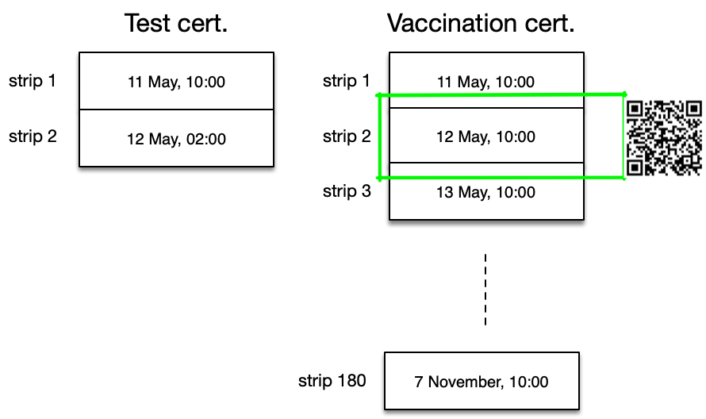
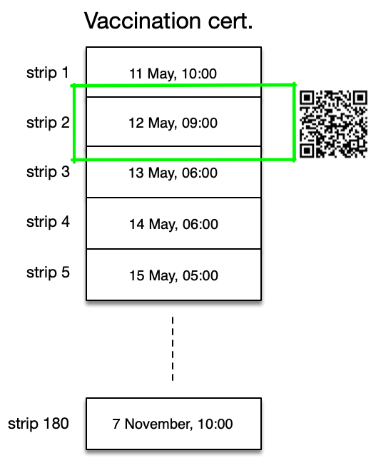
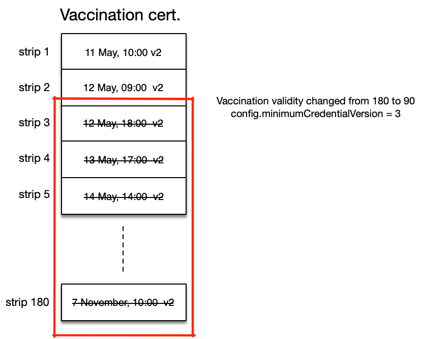
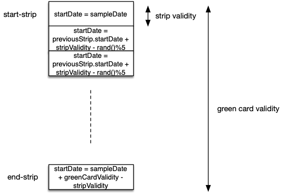

# Privacy Preserving Domestic Green Card

*Providing proof of vaccination or a negative test result without disclosing a person's vaccination status.*

* Authors: Tomas Harreveld, Ivo Jansch
* Version: 0.9

## Introduction

The CoronaCheck app and the CoronaCheck Scanner app are part of the Dutch solution to help open up society safely. People can load a negative test result into the CoronaCheck app, and agents at the entrance of a venue can use the CoronaCheck Scanner app to verify if a person at the door has a valid proof of a recent negative test result.

Recently the team has been tasked with adding support for vaccination certificates. To ensure that noone will be pressured to get vaccinated, and to preserve privacy, we have set a requirement that someone should not have to disclose whether one is vaccinated. A negative test and a recovery certificate should always be available as an alternative to being vaccinated.

This provides us with a challenge: since a negative test has a short validity (currently 40 hours) and a completed vaccination has a long validity (to be determined, but let's for now assume a year), the QR could reveal that someone is vaccinated purely by disclosing that the certificate has a long validity. Although we could decide to hide that fact in the CoronaCheck Scanner app, it would still be in the QR, so a modified or alternative scanner app would still be able to derive vaccination status - therefor we have designed a solution that does not disclose the vaccination status in the QR at all, so that even a rogue scanner would not be able to tell the difference between a vaccinated person, a person with a negative test or a person that has recovered from covid and is considered to be immune.

This document presents the solution designed by the CoronaCheck team.

NOTE: This is about the Dutch *domestic* solution. For the European 'Digital Green Card' initiative for cross border travel the solution is not applicable (in its current iteration, a European DGC always disclosed vaccination status as well as several other personal details.)

## Current situation

Our team has consistently followed a 'privacy by design' approach, already disclosing as little as possible about the negative result. Currently, a QR presented by the CoronaCheck app contains the following information:

* The `sampleDate`, which indicated when a person was tested. This value is rounded down to the nearest hour to avoid being able to identify an individual. This date is necessary so the scanner can establish that the test was recent enough.
* The person's initials and birth month/day. This allows an agent to check the result against an ID to ensure people only use their own negative test result. Initials and only a partial birthdate are used to avoid being able to uniquely identify an individual, while still providing enough information to do a visual comparison against an ID. (To ensure 'equal uniqueness' for everyone, some initials and/or the birth day/month may be omitted if the combination of the initials is considered to be too unique - e.g. someone with Z Q initials).
* The test type (pcr, antigen) - This was added to be able to distinguish in validity between test types, but is currently not used.
* A digital signature to establish the authenticity of the test result and to avoid the data values from being tampered with. The system uses a Camenish-Lysyanskaya signature scheme that offers 'unlinkability' properties - in other words, should the signature be scanned multiple times a day, the signature will be different enough to avoid tracking the individual across multiple scans or by the issuer.
* A `credentialVersion` which enables forward/backward compatibility when changes are made to the QR structure.
* An `isSpecimen` flag, to allow test QRs to be generated that can be tested for validity but that will generate a grey 'demo' screen in scanners instead of a green screen.
* An `isPaper` flag, that allows the scanner to distinguish between proofs intended for the CoronaCheck app and proofs on paper. See also [Paper proofs](#paper-proofs)

Currently, CoronaCheck Scanner always checks if a QR is valid for 40 hours after the sample date. To be able to ensure that a vaccinated person will be able to enter for a much longer period, the scanner should be able to see the difference between a test result and a vaccination. But this is a conundrum: it needs precisely the information that we are trying to hide.

## The 'strip card' model

To solve the conundrum we break up our domestic green card in little pieces. A 'strippenkaart' is a well known concept in Dutch public transport, where in the past a bus card was made up of 24 or 32 strips, each strip valid for a single trip on a bus, so we've chosen the 'strippenkaart' (strip card in English) as the analogy for this concept.

Each strip in the strip card is a credential, which has its own signature and `validFrom`. A credential's validity should be based on the smallest validity that our various proofs have. The smallest proof is currently valid for 40 hours for a negative test result. Since in the past this validity was subject of debate, and ranged from 24-48 hours, we have chosen to make the strip size (the `stripValidity`) 24 hours. Even if the validity of a negative test changes: as long as it's not smaller than the `stripValidity`, we don't need to change the strip card model. The stripValidity is encoded in the credential as `validForHours`.

The next picture depicts a sample strip card for both a negative test and a vaccination:

The negative test consists of 2 strips: to cover a 40 hour validity we need 2 24-hour strips. Strips don't have to be adjacent; they can overlap. Indeed in this case they must overlap, because without overlap, our two strips would have 24 + 24 = 48 hours of validity, and we only need 40 hours. So there's an overlap of 8 hours (the second strip starts 8 hours earlier than the first strip ends).

The vaccination on the right hand side of the picture has many more strips. 

When displaying a QR code, the app should select the strip with the latest `validFrom` that is smaller than the current time. E.g. at 12 may, 11.00am, the test certificate strip would need to show strip 2. For the vaccination it would also be strip 2. (The server should never generate 2 strips with the same `validFrom`. However for resilience in the apps, in case it does happen: the apps can arbitrarily choose the first one)

Since the QR includes only the `validFrom`, the digital signature and the limited personal information, nothing is revealed about the vaccination status of the user. For CoronaCheck Scanner (or any other scanner for that matter), there is no difference between strips from a vaccination or from a test certificate.

## Strip Renewal

If the validity of a recovery certificate is half a year, then there are 182 strips to generate. 

We will generate only **28 day**s worth of future strips, as depicted in the following picture:

The reasons we generate only 28 days of strips and not all at once:

* If we have to perform a key roll-over on the private key that signs the certificates, the roll-over period where an old key must still be accepted is at most 28 days.
* If we update the protocol and change the strip format / datastructure, we can roll out new strips to all users within 28 days.
* If a certificate is deemed invalid and should no longer generate strips, a user has at most 28 days of 'still valid' strips in their wallet.

This renewal process means that the CoronaCheck app will have to regularly fetch new strips. To avoid having to fetch strips at the last possible moment before being scanned, this should be opportunistic: If the credential with the highest expiration date is less than `credentialRenewalDays` days away (a config to be added to the app config, initially set to 5) in the wallet and the app happens to be active and online, the app should request new credentials. Note that the last strips in the wallet will then be overwritten by the new set. This is generally not a problem. (We may later add a date offset to the signer).

Apps may employ background checks to renew strips when the app is not actively running; note however that iOS and Android only allow background activity if the app has been active in the last couple of days. This could be used however to optimize the renewal. If there are only 2 days more than `credentialRenewalDays` when the app is running, it may decide to try to fetch the next batch in the background after 2 days. If the user doesn't open their app again, their strips will still be renewed. 

The renewal process should be transparent to the user and is performed by the app without any user interaction. If strip generation fails for a recoverable reason (e.g. server down) and there are still strips left, the renewal can happen at the next attempt.

There will only be user-interaction in the situation where the app needs new strips and the renewal failed and no strips are available. In that case the app must ask the user to go online to re-activate his green card.

## Strip Randomization

It's always been a privacy requirement to hide as much as possible. One of the fields that's been in the domestic green card since the start is the `sampleDate`. Although it's rounded down to the nearest hour, it still exposes when a person got their test. With the strip card model, we can hide this more, by randomizing the starttime of the strips. As long as the first and last strip have the correct time, intermediary strips do not have such a requirement. As long as each strip has some overlap with the strip before, the actual start time doesn't matter.

The next picture illustrates how strips don't need the same start time as long as they overlap:

For the randomization, we initially choose an overlap of 0-4 hours, e.g. the amount of hours to shorten the next strip's start time is determined by rand() % 5.

### Avoiding unintended disclosure of status

Test and vaccination facilities have opening times that are typically in the 8.00 - 20.00 hour range. This means that the validity of test results, at their current 40 hour validity, always end in the 0.00-12.00 range, whereas vaccinations (which have full-day validities) always end in the 8.00 - 20.00 range. This means there is a gap of 4 hours (20.00 - 0.00) that can never be the end of a validity. Given a 24 hour strip length, it can also never be the start. 

If a strip would start between 20.00 and 0.00, one would be able to derive that this is not a 'start' or 'end' strip but one 'in the middle'. Since negative test results don't have such a 'middle strip', this timing could reveal that the user has either been vaccinated or they had covid in the past. Therefor, start times of 20.00 - 0.00 should be avoided in the randomizer.

## Mass Revocation

The strip renewal gives us a way to ensure strips are never more than 28 days old. Still, there might be a few occasions where it is desirable that strips can be revoked earlier. There is no easy way to do that on a per-case basis, but it can be done in bulk. For example, if at some point it is decided that vaccinations don't last a year but only half a year, and we don't want to allow people to retain their current 28 days worth of strips, then we could bump the credential version that is encoded in a strip, and employ a `minimumCredentialVersion` config on the holder and scanner apps. 

If the app reads its config and `minimumCredentialVersion` is, say 2, whereas the strips left in the wallet are of version 1, then the app could renew those strips immediately. This reduces the time it takes to roll out new strips from 28 days to 3 days (3 days is the maximum allowed time for an app to go without reading a new configuration value).

Note that servers should take into account that if this measure is used, a significant amount of users will start renewing strips, so this couuld generate some additional load. Therefor this feature should only be employed if absolutely necessary.

It is required that the scanner also checks the `minimumCredentialVersion`, but it is recommended to only do this after the holder apps have been able to evaluate the config and renew their strips. In practice this means a delay of 3 days between setting the minimum version in the holder config and the scanner config.

## Paper proofs

For paper proofs the strip card model requires a few changes. Using strips of 24 hours would mean that a user would have to print a proof every day, which is deemed unacceptable from a user point of view. Having a longer validity however does reveal more (e.g. if validity is > 40 hours, it can't be a negative test). For paper proofs, this tradeof is deemed acceptable.

For paper proofs, the strip validity is chosen to be 4 weeks (for recovery/vaccination). 

In addition to the `isPaper` flag to distinguish between paper and app strips (app strips have an additional requirement to randomize every 90 seconds, paper does not), we must now also distinguish in length of a strip. For this purpose the field `validForHours` is created. This gives us the ability to distinguish between all 3 scenario's:

* `isPaper=false`, `validForHours=24`: validity 24 hours, refresh requirement 3 minutes, for all in-app proofs
* `isPaper=true`, `validForHours=40`: validity 40 hours, no refresh requirement, for paper negative test proofs.
* `isPaper=true`, `validForHours=28*40`: validity 28 days, no refresh requirement, for paper vaccination/recovery proofs. 

## Appendix 1: Strip data structure

When this document is implemented, a credential (the technical term for a strip) contains the following data:

* The `validFrom` (unix timestamp), which indicated when the strip starts its validity
* The person's initials and birth month/day. 
* The CL signature 
* A `credentialVersion` 
* An `isPaper` flag, see [Paper proofs chapter](#paper-proofs).
* The `validForHours` value, indicating the validity of that strip
* An `isSpecimen` flag, to allow test QRs to be generated that can be tested for validity but that will generate a grey 'demo' screen in scanners instead of a green screen.

## Appendix 2: Generating credential strips

Terminology:
* Green card validity: The validity of the green card based on the type, e.g. 40h for a test, 365d for a vaccination, 180d for a recovery. (determined by a config)
* Strip validity: The time that a scanner will deem this strip valid (24 hours, determined by the strip's `validForHours` field)
* Granularity: How much strips are spaced apart (validity minus a random amount). 
* Start-strip: The strip at the start of the green card validity
* End-strip: The strip at the end of the green card validity

The following rules should be applied when generating strips.

### For an app

* The start-strip should *start* on the rounded down `sampleDate`. 
* The end-strip should *end* on the rounded down `sampleDate + green card validity`. Since a strip only has a `validFrom` and not a `validUntil`, the `validFrom` of the end-strip is the `endDate - stripValidity` 
* Only generate strips with future validity. This means that the start-strip is sometimes not used.  
* Never generate strips with a `validFrom` higher than `today + 28 days`. This means that the end-strip is only generated when strips are renewed for the final 28 days of the green card validity.
* All other strips should have a `validFrom` that is `previousStrip.validFrom + stripValidity - rand()%5 hours`, causing a random strip overlap of 0-4 hours.
* If the `validFrom` ends up in 20.00 - 0.00 range (nl timezone), *subtract* 4 hours (don't round them all to 20.00 as that would give a larger than usual amount of 20.00 strips)
* Set the `validForHours` of each strip to 24 

Some of the calculations visualized:

### For a paper test proof

* Never generate more than 1 strip
* Set the `validForHours` of the strip to 40
* Generate only a single strip, which starts on the rounded down `sampleDate`

### For a paper vaccination/recovery proof

* Never generate more than 1 strip
* Set the `validForHours` to 1.120 (28 days * 40 hours)
* If the green card's validity ends within 28 days:
   * Generate an 'end strip', which starts on the `sampleDate + greencardValidity - stripValidity`
* Else, if the `sampleDate` is less then 28 days ago: (*)
   * Generate only a 'start strip', whose `validFrom` starts on the rounded down `sampleDate`
* Else: 
   * Generate a 'middle strip' whose `validFrom` starts today
   
(*) Todo: we never hand out test/vaccination results that start in the future so we could theoretically omit this startStrip entirely and always generate a strip that starts today. This however also depends on where we implement the 'vaccination only valid from day 11'. Do we set our startDate to sampleDate + 11, or is this a business rule in the scanner?

