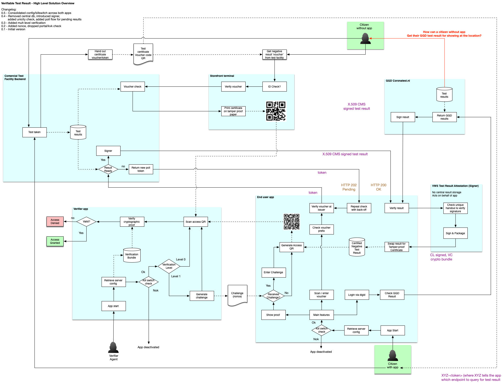
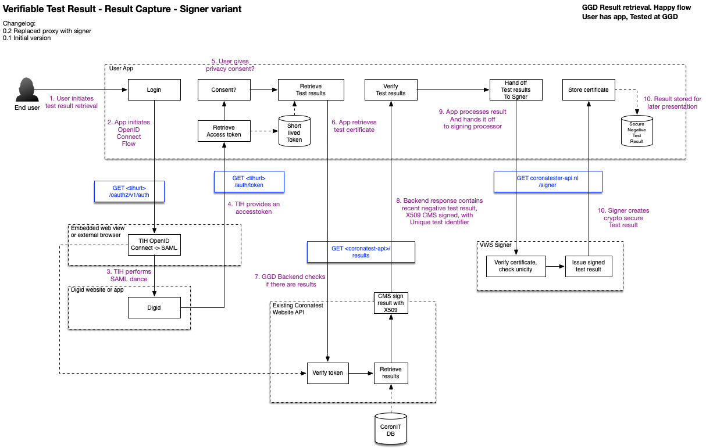
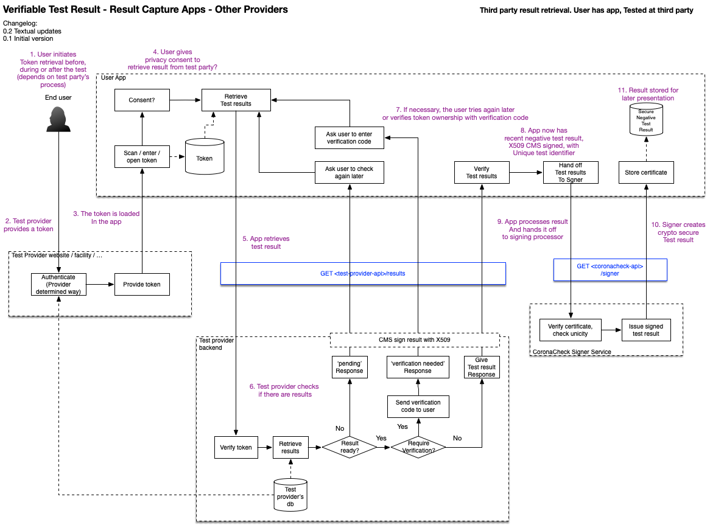

# COVID-19 CoronaTester Verifiable Test Result - Solution Architecture

**Version:** 0.2 (Work in Progress)

# Introduction

The Dutch Ministry of Health, Welfare and Sport has commissioned a project team to experiment with the technical possibilities surrounding a 'verifiable test result' that would let indiduals prove the fact that they have recently tested negative for COVID-19. The name of the app has yet to be determined, for now we use the working title 'CoronaTester App'. This document describes the functional and technical architecture of the CoronaTester app.

This document describes the privacy and security risks associated with the use cases for a citizen being able to prove vaccination or the veracity of a negative test result. This is driven by the anticipated need for a COVID-19 proof of vaccination requirement both internationally. Note that there is currently no national requirement for such proof.

In particular, the risks and mitigations are explored for both paper-based and digital versions of possible implementations for a proof of vaccination or negative test.

This document explores the realm of possible technical implementation options and the social and legal requirements that constrain which of the technical implementations may be chosen. As such, this interplay defines the envelope within which realistic solutions are likely to fit.

This document is work in progress and will be adjusted during the project. Given the nature of the project, this specification, its requirements and the solution as a whole should not be considered 'final' but a continuous work in progress. 

# Table of contents

- [COVID-19 CoronaTester Verifiable Test Result - Solution Architecture](#covid-19-coronatester-verifiable-test-result---solution-architecture)
- [Introduction](#introduction)
- [Table of contents](#table-of-contents)
- [Requirements](#requirements)
  * [Design Input](#design-input)
  * [General Guiding principles](#guiding-principles)
  * [Functional Requirements](#functional-requirements)
  * [Non-functional Requirements](#non-functional-requirements)
- [Key characteristics](#key-characteristics)
- [High Level Architecture](#high-level-architecture)
  * [Concept](#concept)
  * [Solution](#solution)
  * [Protocol](#protocol)
  * [Security vs usability](#security-vs-usability)
- [Flows](#flows)
  * [Flow 1: Retrieving a GGD test result](#flow-1--retrieving-a-ggd-test-result)
- [System Landscape](#system-landscape)
- [Security & Privacy](#security--privacy)
  * [Overview](#overview)
  * [Attack Surface Minimisation](#attack-surface-minimisation)
  * [Data cleanup](#data-cleanup)
  * [App/Device Verification](#appdevice-verification)
- [Backend](#backend)
  * [Backend overview](#backend-overview)
  * [Data model](#data-model)
  * [Public API](#public-api)
  * [Result API](#result-api)
  * [Workers](#workers)
- [App Considerations](#app-considerations)
  * [Technology Choices](#technology-choices)
  * [Native vs hybrid development](#native-vs-hybrid-development)
  * [Lifecycle Management](#lifecycle-management)

# Requirements

The project has an experimental nature. The requirements are derived from various brainstorm sessions and input from various stakeholders. We seek to explore the possibilities and limitations of technology to provide society with the ability to use a negative test result to open up certain activities.

## Design Input

We are building the requirements of the first version on a problem domain, in an agile process in close cooperation with the design team. The designs in the design repository (https://github.com/minvws/nl-covid19-coronatester-app-design) and this solution architecture together reflect the outcome of this agile process.

## General Guiding principles

In addition to the requirements, we have defined a number of guiding principles that a solution must adhere to. This means that this project has a number of key contextual requirements that drive or otherwise define the architecture or are used as a benchmark:

* [Gezondheidsraad - Testbewijzen voor SARS-CoV-2: ethische en juridische voorwaarden](https://www.gezondheidsraad.nl/documenten/adviezen/2021/01/14/testbewijzen-voor-sars-cov-2-ethische-en-juridische-voorwaarden)

* [Baseline Informatiebeveiliging Overheid 1.04](https://bio-overheid.nl/media/1400/70463-rapport-bio-versie-104_digi.pdf)

* [Algemene Verordening Gegevensbescherming (AVG)](https://autoriteitpersoonsgegevens.nl/sites/default/files/atoms/files/verordening_2016_-_679_definitief.pdf) 

* [Handreiking Mobiele App Ontwikkeling en Beheer 3.0](https://www.noraonline.nl/images/noraonline/a/a5/Handreiking_Mobiele_App_3.0.pdf) 

* [Web Content Accessibility Guidelines 2.1](https://www.w3.org/TR/WCAG21/)

* [NCSC beveiligingsrichtlijnen voor webapplicaties](https://www.ncsc.nl/documenten/publicaties/2019/mei/01/ict-beveiligingsrichtlijnen-voor-webapplicaties)

* [NCSC beveiligingsrichtlijnen voor mobiele apps](https://www.ncsc.nl/documenten/publicaties/2019/mei/01/ict-beveiligingsrichtlijnen-voor-mobiele-apps)

## Functional Requirements

The main requirement is the ability to provide a *verifiable* test result to a 'verifier'. This means that someone can show a test result to prove that they are not infected with COVID-19. The 'verifiable' part means that the result is cryptographically secured in such a way that a verifier can reasonably rely on the presenter presenting a proof of an actual negative result (without having to identify the user, nor to see their test result details)

## Non-functional Requirements

We have identified the following non-functional requirements:

1. The solution should be usable by a large portion of the Dutch population. 
2. This means, among other things, that a verifiable test result is ideally not limited to people who own a smartphone. During the experiment we should explore possibilities for non-digital alternatives.
3. For privacy reasons, a verifiable test result should be untraceable. This means that a test result is not traceable to an actual person (while still maintaining the ability to reasonably assess that the result belongs to the person showing it).
4. It should also be 'multi-show unlinkable'. This means that if the user shows a test result at two different locations, the verifier should not be able to derive that the 2 scans belong to the same user.
5. The previous bullet also applies to the issuer, subsequent events should not be linkable by the issuer either.
5. No personal details other than a test result and a limited set of credentials to bind the result to a specific person (e.g. part of birthdate, initials) should be part of the VTR.
6. The verifiable test result should NOT imply that someone is *positive*. It implies only a *negative* result. Absence of a valid negative result could mean the user has tested positive, but could also mean the user was not tested at all. It is not relevant for a verifier to know the distinction.
7. A verifiable test result should be time-limited, and the time limit should be remotely configurable to match epidemiological circumstances (e.g. the incubation time of the most prevalent strain of the Corona virus.)
8. The verifiable test result should not have a history. After the result expires, it should be deleted.
9. An end user app must not rely on an online connection during verification. Circumstances may be such that network coverage is limited and Wi-Fi is not available (e.g. a remote festival venue, or a mall with limited cell network coverage)
10. Likewise, the verifier app must not rely on an online connection during verification either. 
11. A connection may however be required to prepare the apps for verification (prior to the verification in the field).
12. The ability must exist to disable the app if circumstances require termination of result verification (e.g. the end of the pandemic)
13. The ability must exist to determine if the use of test verification is proportional and allowed. This should be enforced either as part of the solution, or as part of legislation.
14. Although the nature of this project is an experiment, the solution should be build with scalability in mind, so it can be developed into a production-ready solution.

The solution should offer reasonable protection against abuse by implementing, among other things:

15. Protection against replay attacks (showing the same proof twice, e.g. by handing over your phone to someone else)
16. Protection against pregeneration attacks (QR codes generated by a hacker and distributed on a website)
17. Protection against false result injection (a user generating proof of a negative result without an actual test),
18. Protection against identity theft (showing the result of someone else)
19. Protection against forgery (someone faking a negative test result and/or faking/abusing issuer signatures)
20. Protection against reverse engineering of the protocol. In fact, the protocols are open and the code should be open souce. Security should be derived from cryptographic solidity and not rely on security by obscurity.

# Key characteristics

## Privacy by design

For the app we follow a Privacy by Design approach. This means:

* We will not collect more data than necessary. 
* Data that we do collect is protected with appropriate measures
* We apply end-to-end security

## Open Source

All source code will be made available on the [Ministry's GitHub account](https://github.com/minvws).

# High Level Architecture

## Concept

The concept for the Verifiable Test Result experiment consists of the following components:

1. An app that allows users to show a verifiable test result after a negative test.
2. A fallback to show that same proof in a non-digital alternative.
3. An app that allows verifiers to verify the authenticity of a test result.
4. A backend that the end user app will use to retrieve a cryptographically secure, verifiable, test result
5. A backend that the verifier app will use to receive authorization to perform scans.
6. Backends of COVID test suppliers that will supply or verify negative test results.

## Terminology

Throughout this document we use a number of core concepts. To get an understanding of what's what, here is a short explanation of the most important terms:

* A *verifier* is the person/entity that wants to verify test results (e.g. the owner of a venue).
* An *agent* is the person that performs the actual verification (e.g. a bouncer at the door)
* An *issuer* is the provider of certified test results (e.g. a health authority)
* A *citizen* is a person who was tested and wants to enter a venue.

## Solution
The following diagram depicts the high level architecture of the solution. The diagram can best be interpreted by starting at one of the user icons and following their actions across the system. In later versions of this document we will detail some of these flows in separate diagrams in more detail.

Two core guiding principle of the solution are:

* We want to avoid linkability to persons as much as possible, so the system works with tokens/vouchers instead of personally identifiable numbers (BSN) where possible.
* We want to avoid a 'central storage' of test results. This is why we 'federate' the actual verification of test result to the original provider of the test result (issuer). In the solution we have included a central storage for suppliers that have no other way to deliver test results, but this is highly undesirable and may be dropped from the solution if test providers offer sufficient ability for federated result checks.

## Protocol

For the solution we will adopt a protocol that is comparable in nature to the [Verifiable Credentials](https://www.w3.org/TR/vc-use-cases/) protocol by the W3 consortium. We will initially investigate the Idemix cryptographic suite, because it by design has properties such as multi-show unlinkability. The protocol could be made compatible with the W3 Verifiable Credentials implementation.

We will initially not use the standardized 'Verifiable Presentation' data format, because we need a small enough data/communication size, so that the verifiable test result will fit inside a scannable QR code. (We will conduct experiments to determine scannability of QRs of various sizes on various devices in various conditions - e.g. an older Android phone in low lighting conditions with a smudged screen.)

## Security vs Usability

There is a trade-off between security and usability. Although we will set a minimum baseline of security that the solution must always adhere to, there are a few points where a reasonable trade-off can be made.

* To have the optimal protection against pregeneration attacks, a generated test result should use a 'challenge' (nonce) received from the verifier in real time. This ensures that a QR is generated specifically for a single session and it provides the optimal set of parameters to avoid attacks. However, this will imply an extra step the user must take (e.g. enter the challenge that a verifier has provided prior to the verification scan)
* To speed up processing in access queues, verifiers might want to forego on exchanging the challenge, at the expense of some security (pregeneration becomes more feasible). Other mitigations to avoid pregeneration should be included in the solution if this variant is used. 

Since the required level of protection might depend on the circumstances (e.g. an event might opt for speedy access lines at the cost of a small chance of someone providing a rogue test result, while a home for the elderly might want optimal protection of their inhabitants), the actual level is left at the discretion of the verifier, by ways of a setting in the app that indicates whether 'level 0' or 'level 1' protection is to be used. (perhaps later to be extended to even more different levels based on the results of the experiment.)

# Flows

This chapter describes the core flow that we are following, which is derived from the requirement, UX research and various discussions with the team.

## Flow 1: Retrieving a GGD test result 

The following diagram describes how the solution would retrieve a **negative** test result from a GGD test (positive results are not relevant to the solution), and convert it to a verifiable test result. For GGD test results we can use a digid authentication mechanism. 

## Flow 2: Retrieving a third party test result

The following diagram describes what the flow looks like for third parties where we can't retrieve the test result via BSN/Digid check. 

In this scenario the digid login has been replaced by a token mechanism. A user might still have to login (via digid or otherwise) at the test provider, to obtain access to the necessary token.

The following diagram details how this token flow works in detail. Note that the 'login on the test provider site' is just an example, as how this part of the flow works is entirely up to the test provider.

# System Landscape

TODO

# Security & Privacy

## Guiding principles

* We provide as little data/knowledge about the user to anyone, including our own backend.
* If we can move logic from a server to an app, to preserve privacy, we will do so, even if that means more work in the app and less work in the backend.
* We try to avoid risks by federating certain functionality to the test vendors (e.g. we prefer to verify the result at the vendor, rather than storing results in a central database.)

## Overview

The details surrounding the security and privacy implementation of the app is laid out in the document [‘Security Architecture’](Security Architecture.md). While the details and rationale surrounding the choices can be found in that document, for this solution architecture we have outlined the key principles from the preliminary version in the following diagram.

Todo

Each part of the diagram tries to address a number of key aspects:

* Source authenticity: how can we ensure that data comes from a known / trusted source.

* Destination authenticity: how can we ensure that data gets sent to a known / trusted source.

* Data integrity: how can we ensure that the data has not been tampered with.

* Data protection: how can we ensure that only authorized people can access the data.

## Attack Surface Minimisation

We practice 'attack surface minimisation' to reduce risks. This means we pay attention to the following:

* No more API calls than necessary for the operation of the app (no exposure of generic REST endpoints).
* No more fields in input/output than necessary (calls will provide specific answers instead of generic entities).
* Internal / machine to machine API calls separated from public / app to backend API calls.
* Where possible, deliver data via push and/or queueing mechanisms between APIs instead of via pull.

## Data cleanup

We don't want to keep data around longer than necessary. Therefor we have defined a few rules we apply for data cleanup:

### Backend cleanup

* Test results that are no longer valid should be cleaned up on a daily basis.

### Apps cleanup

Todo

## App/Device Verification

This part is taken directy from the CoronaMelder architecture, and we follow the route we have taken there:

The Google Reference Implementation of a backend for exposure notification suggests the use of DeviceCheck (iOS) and Safetynet Attestation (Android) to validate if a request comes from a genuine android device and/or from the official app:

* [https://github.com/google/exposure-notifications-server/blob/master/docs/server_functional_requirements.md](https://github.com/google/exposure-notifications-server/blob/master/docs/server_functional_requirements.md)

The documentation for DeviceCheck and Safetynet Attestation can be found here:

* [https://developer.apple.com/documentation/devicecheck](https://developer.apple.com/documentation/devicecheck)

* [https://developer.android.com/training/safetynet/attestation](https://developer.android.com/training/safetynet/attestation)

We have decided not to apply these platform specific checks. First, it relies on a server API at Apple and Google, which can be down and could be a privacy risk.

Second, the Android Developer blog states: 

"*In other words, not all users who fail attestation are necessarily abusers, and not all abusers will necessarily fail attestation. By blocking users solely on their attestation results, you might be missing abusive users that don't fail attestations. Furthermore, you might also be blocking legitimate, loyal customers who fail attestations for reasons other than abuse*" (NOTE:  https://android-developers.googleblog.com/2017/11/10-things-you-might-be-doing-wrong-when.html)

The safetynet attestation documentation further states about attestation failure: *"Most likely, the device launched with an Android version less than 7.0 and it does not support hardware attestation. In this case, Android has a software implementation of attestation which produces the same sort of attestation certificate, but signed with a key hardcoded in Android source code. Because this signing key is not a secret, the attestation could have been created by an attacker pretending to provide secure hardware"* (NOTE:  https://developer.android.com/training/articles/security-key-attestation)

This leads us to believe that when applying these checks, we introduce risks and dependencies while not gaining a substantial amount of security.

# Backend  

## Backend overview

The following diagram describes the overall backend architecture, for now only the part that deals with test verification. 

Todo.

The idea is to generate a database of all locations and the capacity for the next few days, so that the apps can download the entire set. This way, we don't have to query a server for nearby locations, and we can keep location features entirely local in the app.

## Data model

Todo.

## Public API (papi)

The public API is the API that is accessible via the public internet, by the CoronaTester apps. The following diagram describes the architecture of this public API: TODO

The definition of the Public API can be found in the [API Swagger Files](api/) (TODO)

## Verifiable Results API (vrapi)

The Result API is the API that vendors should implement in order for us to get (a verification of) test results. A specification of this API can be [found here](https://github.com/minvws/nl-covid19-coronatester-app-coordination/blob/main/docs/providing-test-results.md)

## Workers

So far we have identified no workers.

# App Considerations

## Technology choices

* iOS app: Native Swift / MVVM based architecture. Baseline iOS 11+.
* Android app: Native Kotlin / MVVM based architecture. Baseline Android 5+.
* Core backend services: written in dotnet core, hosted in a container based environment (Docker containers).
* BFF for apps: PHP/Python/etc, using a commonly used framework. Or: dotnetcore (to potentially reuse some coronamelder code).
* Any necessary web portals: PHP 7/Laravel with a VueJS frontend (to potentialy reuse GGD Contact portal effort).
* Queing and caching mechanisms: Redis (with cluster/sentinel).
* Database: Postgresql (to be able to use built in encryption mechanisms) (TODO: Or MS SQL if we want to reuse CoronaMelder code/tooling?).

## Native vs hybrid development

Mobile apps will be implemented as native applications, with Swift as the language used for iOS development and Kotlin for Android development.

We have carefully considered whether to do native development or use a cross platform technology, and the following arguments were leading:

* There are no requirements or constraints that dictate the use of cross platform tools.

* The available development team has sufficient capability in native app development.

* It is expected that, should we need help from Google or Apple to resolve issues while implementing this app, they can do so more efficiently if we use the development stack provided by the vendors.

* In order to ease [security] code-reviews and thus keeping them accessible to a wider audience, it is prudent to keep the app's stack and usage of programming paradigms as vanilla and lean as possible.

## Lifecycle Management

Apps run on the user’s device and updates require a review process that is not entirely under our control. To mitigate these factors that are outside our control, apps should implement a form of lifecycle management. This includes the following features:

* Configuration values or content that are expected to change should be retrieved from a server.

* Apps should offer a ‘forced upgrade’ (i.e. if a new version is available that fixes a critical bug, it should be possible to force the user to upgrade). 

# Changelog

0.2 - Updated flow diagrams, added third party test result collection. 
0.1 - initial draft

