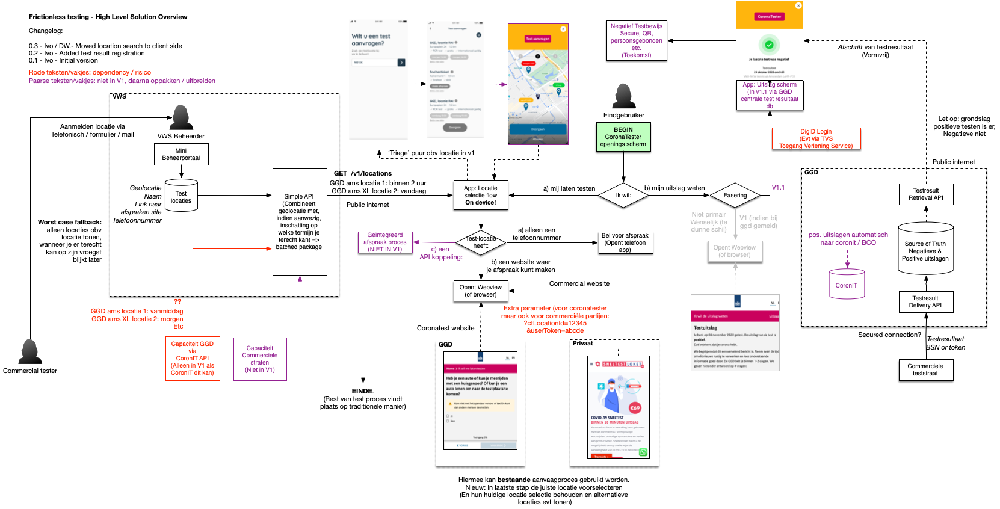
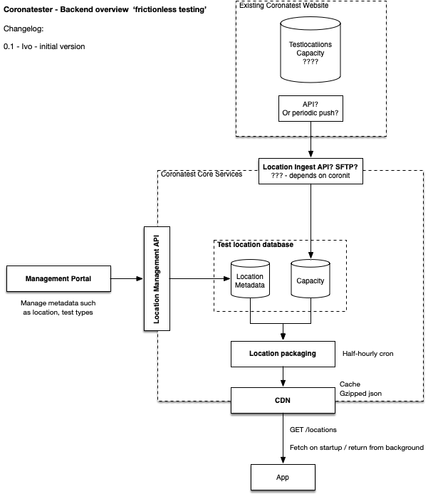
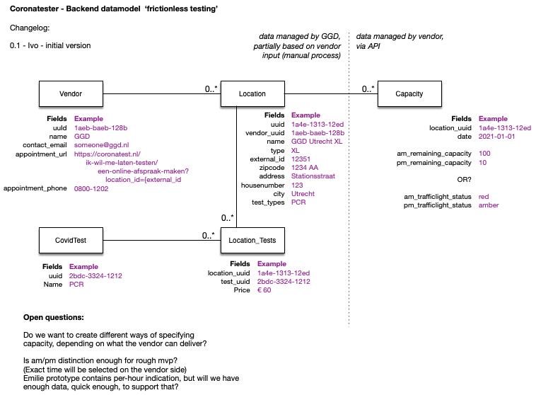

# COVID-19 CoronaTester App - Solution Architecture

**Version:** 0.1 (Work in Progress)

# Introduction

The Dutch Ministry of Health, Welfare and Sport is developing an app to improve the COVID-19 test processes. The name of the app has yet to be determined, for now we use the working title 'CoronaTester App'. This document describes the functional and technical architecture of the CoronaTester app.

This document is work in progress and will be adjusted during the project.

# Table of contents

- [COVID-19 CoronaTester App - Solution Architecture](#covid-19-coronatester-app---solution-architecture)
- [Introduction](#introduction)
- [Table of contents](#table-of-contents)
- [Requirements](#requirements)
  * [GGD Requirements](#ggd-requirements)
  * [General Guiding principles](#guiding-principles)
- [Key characteristics](#key-characteristics)
- [High Level Architecture](#high-level-architecture)
- [Flows](#flows)
- [System Landscape](#system-landscape)
- [Security & Privacy](#security--privacy)
  * [Overview](#overview)
  * [Attack Surface Minimisation](#attack-surface-minimisation)
  * [Data cleanup](#data-cleanup)
  * [App/Device Verification](#appdevice-verification)
- [Backend](#backend)
  * [Backend overview](#backend-overview)
  * [Data model](#data-model)
  * [Public API](#public-api)
  * [Vendor API](#private-api)
  * [Workers](#workers)
- [App Considerations](#app-considerations)
  * [Technology Choices](#technology-choices)
  * [Native vs hybrid development](#native-vs-hybrid-development)
  * [Lifecycle Management](#lifecycle-management)

# Requirements

## Design Input

We are basing the requirements of the first version on a problem domain, defined in an agile process in close cooperation with the design team. The designs in the design repository (https://github.com/minvws/nl-covid19-coronatester-app-design) and this solution architecture together reflect the outcome of this agile process.

## General Guiding principles

In addition to the requirements, we have defined a number of guiding principles that a solution must adhere to. This means that this project has a number of key contextual requirements that drive or otherwise define the architecture or are used as a benchmark:

* [Baseline Informatiebeveiliging Overheid 1.04](https://bio-overheid.nl/media/1400/70463-rapport-bio-versie-104_digi.pdf)

* [Algemene Verordening Gegevensbescherming (AVG)](https://autoriteitpersoonsgegevens.nl/sites/default/files/atoms/files/verordening_2016_-_679_definitief.pdf) 

* [Handreiking Mobiele App Ontwikkeling en Beheer 3.0](https://www.noraonline.nl/images/noraonline/a/a5/Handreiking_Mobiele_App_3.0.pdf) 

* [Web Content Accessibility Guidelines 2.1](https://www.w3.org/TR/WCAG21/)

* [NCSC beveiligingsrichtlijnen voor webapplicaties](https://www.ncsc.nl/documenten/publicaties/2019/mei/01/ict-beveiligingsrichtlijnen-voor-webapplicaties)

* [NCSC beveiligingsrichtlijnen voor mobiele apps](https://www.ncsc.nl/documenten/publicaties/2019/mei/01/ict-beveiligingsrichtlijnen-voor-mobiele-apps)

# Key characteristics

## Privacy by design

For the app we follow a Privacy by Design approach. This means:

* We will not collect more data than necessary. 
* Data that we do collect is protected with appropriate measures
* We apply end-to-end security

## Open Source

All source code will be made available on the ministry's GitHub account.

# High Level Architecture

## Concept

For the MVP of the product we will produce an android and iOS app that have 2 main functions:

1. Provide insight in test locations and their availability
    1.1. An overview of test locations in The Netherlands. 
    1.2. For each location: a rough indication of capacity for this morning, this afternoon, tomorrow morning, etc.
    1.3. If possible: the locations plotted on a map so that the user can see which one is the closest.
2. Provide the user with the result of their last test.
    1.1. Logging in via Digid
    1.2. Seeing the result of recent tests, including at which location they have been made.
    
    
TODO / WHICH OF THESE REQUIREMENTS DO WE WANT/NEED:

* The ability to provide relevant personal details to a test location upon registering for a test.
* A token exchange where we provide user details to the GGD server (for later BCO purposes) and receive a token in return. This token can then be provided to the vendor to retrieve a subset of data to accommodate the test
* A rating mechanism where you can see for a location how well they do / how far they are integrated.
* Lead tracking / KPIs surrounding time between refering the user and receiving their result. 

## Solution
The following diagram depicts the high level architecture of the solution:

# Flows

This chapter describes the core flow that we are following, which is derived from the requirement, UX research and various discussions with the health authority.

TODO

# System Landscape

TODO

# Security & Privacy

## Guiding principles

* We provide as little data/knowledge about the user to anyone, including our own backend.
* If we can move logic from a backend server to an app, to preserve privacy, we will do so, even if that means more work in the app and less work in the backend.
* We try to avoid risks by relegating certain functionality to the test vendors (e.g. we prefer to link to the registration process of the vendor, rather than integrating the registration process inside the app.)

## Overview

The details surrounding the security and privacy implementation of the app is laid out in the document [‘Security Architecture’](Security Architecture.md). While the details and rationale surrounding the choices can be found in that document, for this solution architecture we have outlined the key principles from the preliminary version in the following diagram.

Todo

Each part of the diagram tries to address a number of key aspects:

* Source authenticity: how can we ensure that data comes from a known / trusted source

* Destination authenticity: how can we ensure that data gets sent to a known / trusted source

* Data integrity: how can we ensure that the data has not been tampered with.

* Data protection: how can we ensure that only authorized people can access the data

## Attack Surface Minimisation

We practice 'attack surface minimisation' to reduce risks. This means we pay attention to the following:

* No more API calls than necessary for the operation of the app (no exposure of generic REST endpoints)
* No more fields in input/output than necessary (calls will provide specific answers instead of generic entities)
* Internal / machine to machine API calls separated from public / app to backend API calls
* Where possible, deliver data via push and/or queueing mechanisms between APIs instead of via pull.

## Data cleanup

We don't want to keep data around longer than necessary. Therefor we have defined a few rules we apply for data cleanup:

### Backend cleanup

* Location capacity in the past is not useful, so the capacity tables can be cleaned up on a daily basis.

### Apps cleanup

Todo

## App/Device Verification

This part is taken directy from the CoronaMelder architecture, and we follow the route we have taken there:

The Google Reference Implementation of a backend for exposure notification suggests the use of DeviceCheck (iOS) and Safetynet Attestation (Android) to validate if a request comes from a genuine android device and/or from the official app:

* [https://github.com/google/exposure-notifications-server/blob/master/docs/server_functional_requirements.md](https://github.com/google/exposure-notifications-server/blob/master/docs/server_functional_requirements.md)

The documentation for DeviceCheck and Safetynet Attestation can be found here:

* [https://developer.apple.com/documentation/devicecheck](https://developer.apple.com/documentation/devicecheck)

* [https://developer.android.com/training/safetynet/attestation](https://developer.android.com/training/safetynet/attestation)

We have decided not to apply these platform specific checks. First, it relies on a server API at Apple and Google, which can be down and could be a privacy risk.

Second, the Android Developer blog states: 

"*In other words, not all users who fail attestation are necessarily abusers, and not all abusers will necessarily fail attestation. By blocking users solely on their attestation results, you might be missing abusive users that don't fail attestations. Furthermore, you might also be blocking legitimate, loyal customers who fail attestations for reasons other than abuse*" (NOTE:  https://android-developers.googleblog.com/2017/11/10-things-you-might-be-doing-wrong-when.html)

The safetynet attestation documentation further states about attestation failure: *"Most likely, the device launched with an Android version less than 7.0 and it does not support hardware attestation. In this case, Android has a software implementation of attestation which produces the same sort of attestation certificate, but signed with a key hardcoded in Android source code. Because this signing key is not a secret, the attestation could have been created by an attacker pretending to provide secure hardware"* (NOTE:  https://developer.android.com/training/articles/security-key-attestation)

This leads us to believe that when applying these checks, we introduce risks and dependencies while not gaining a substantial amount of security.

# Backend  

## Backend overview

The following diagram describes the overall backend architecture, for now only the part that deals with test location and capacity management. Test results will follow soon.

The idea is to generate a database of all locations and the capacity for the next few days, so that the apps can download the entire set. This way, we don't have to query a server for nearby locations, and we can keep location features entirely local in the app.

## Data model

For the datamodel of the test location and capacity we propose the following:

TODO: There are some open questions in the diagram. Also note that we haven't included process-columns such as created_at, updated_at, etc.

## Public API

The public API is the API that is accessible via the public internet, by the CoronaTester apps. The following diagram describes the architecture of this public API:

The definition of the Public API can be found in the [API Swagger Files](api/) (TODO)

## Vendor API

The Vendor API is the API that vendors use to update their capacity. (TODO: is this an API, or will they upload CSVs throuh sftp, or ...)

## Workers

So far we have identified 2 worker:

* A worker that will run twice per hour and aggregate all location metadata and capacity into a single response that apps can download.
* A cleanup worker that removes capacity records for the past day.

# App Considerations

## Technology choices

* iOS app: Native Swift / MVVM based architecture. Baseline iOS 11+
* Android app: Native Kotlin / MVVM based architecture. Baseline Android 5+
* Core backend services: written in dotnet core, hosted in a container based environment (Docker containers)
* BFF for apps: for now: dotnetcore (to potentially reuse some coronamelder cdn code)
* Management CMS: PHP 7/Laravel with a VueJS frontend (to potentialy reuse GGD Contact portal effort)
* Queing and caching mechanisms: Redis (with cluster/sentinel)
* Database: Postgresql (to be able to use built in encryption mechanisms) (TODO: Or MS SQL if we want to reuse CoronaMelder hosting?)

## Native vs hybrid development

Mobile apps will be implemented as native applications, with Swift as the language used for iOS development and Kotlin for Android development.

We have carefully considered whether to do native development or use a cross platform technology, and the following arguments were leading:

* There are no requirements or constraints that dictate the use of cross platform tools.

* The available development team has sufficient capability in native app development.

* It is expected that, should we need help from Google or Apple to resolve issues while implementing this app, they can do so more efficiently if we use the development stack provided by the vendors.

* In order to ease [security] code-reviews and thus keeping them accessible to a wider audience, it is prudent to keep the app's stack and usage of programming paradigms as vanilla and lean as possible.

## Lifecycle Management

Apps run on the user’s device and updates require a review process that is not entirely under our control. To mitigate these factors that are outside our control, apps should implement a form of lifecycle management. This includes the following features:

* Configuration values or content that are expected to change should be retrieved from a server.

* Apps should offer a ‘forced upgrade’ (i.e. if a new version is available that fixes a critical bug, it should be possible to force the user to upgrade). 

