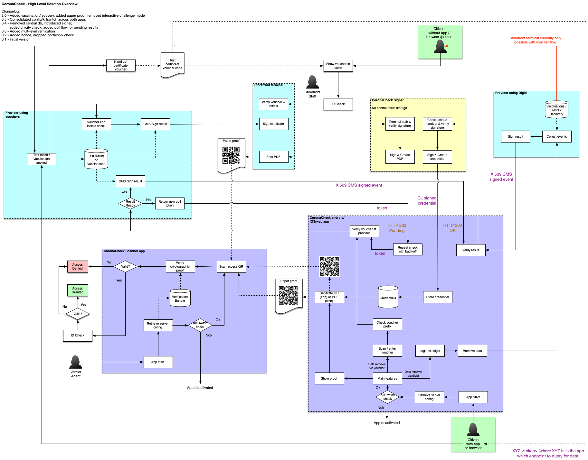
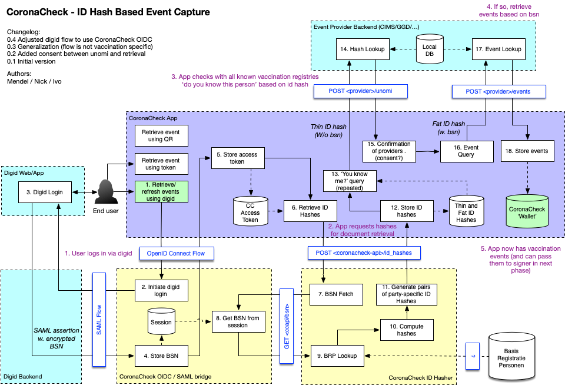
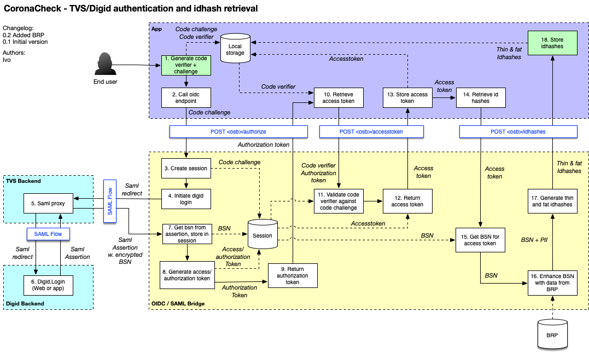
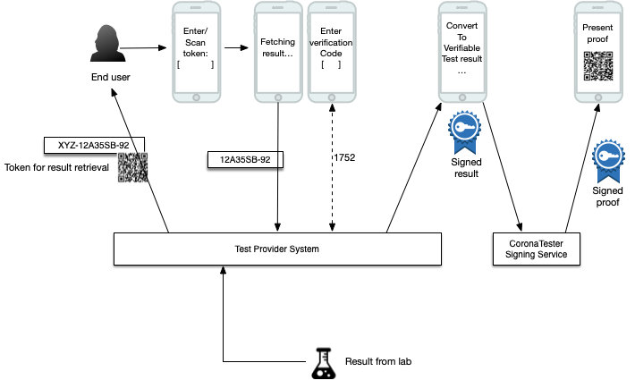
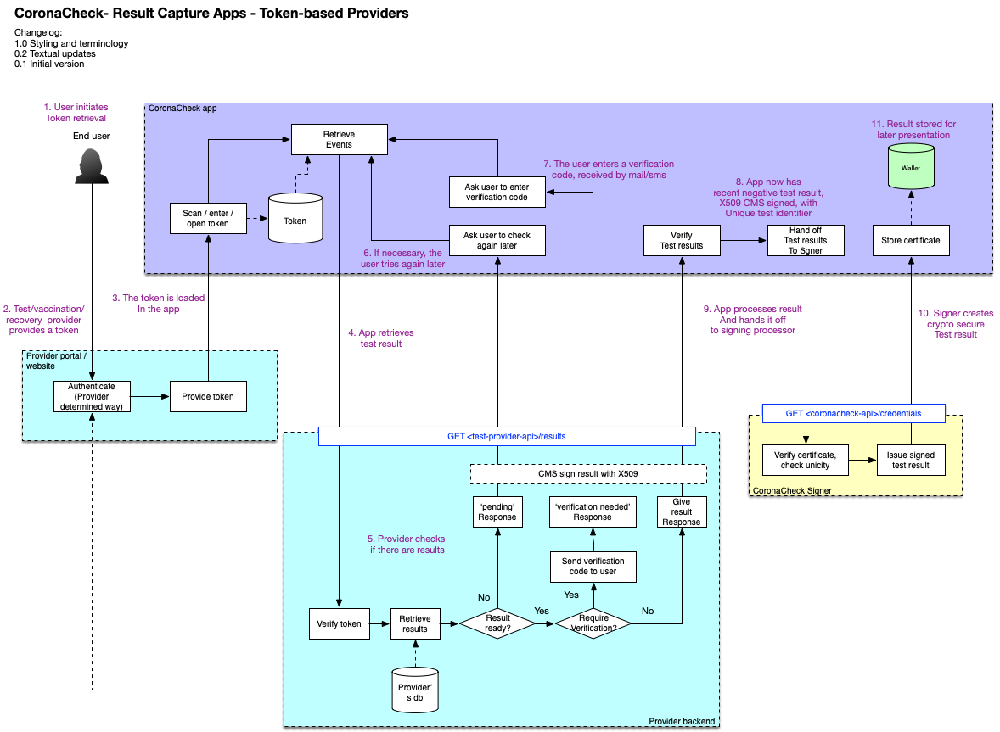
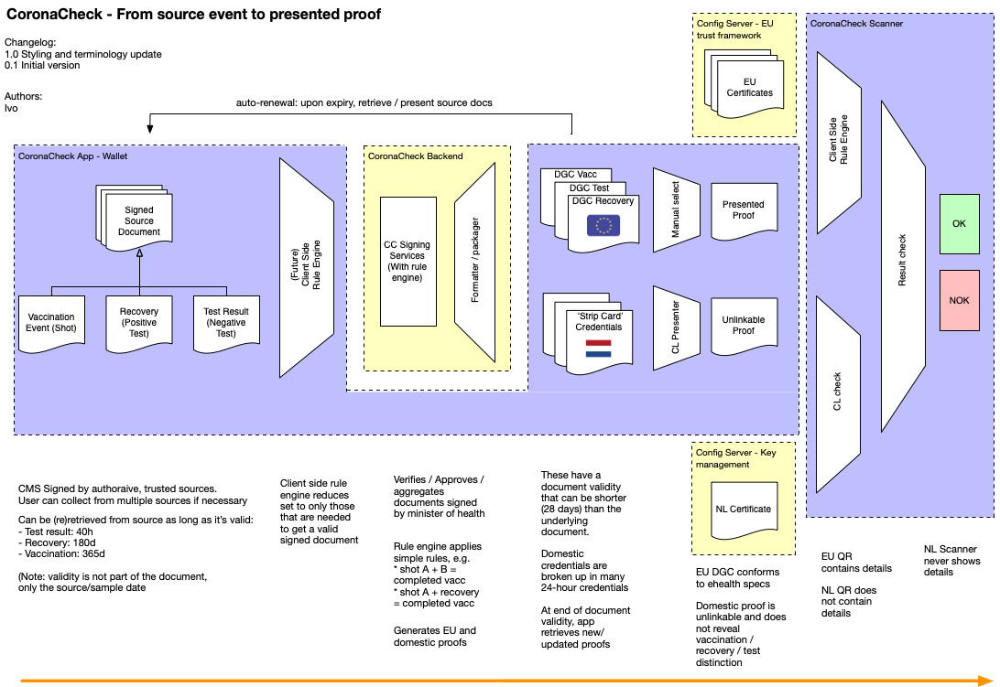
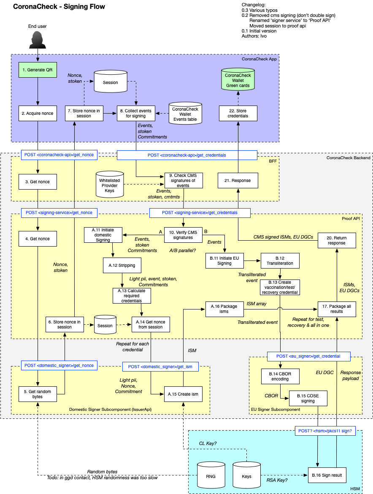
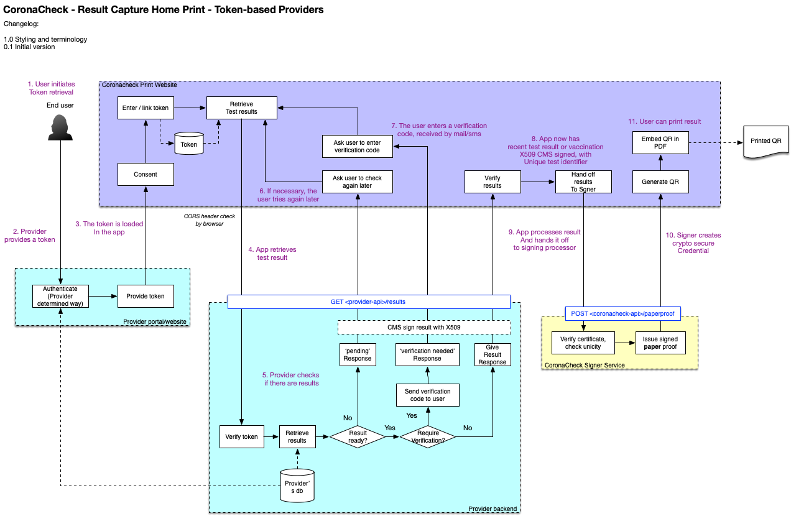
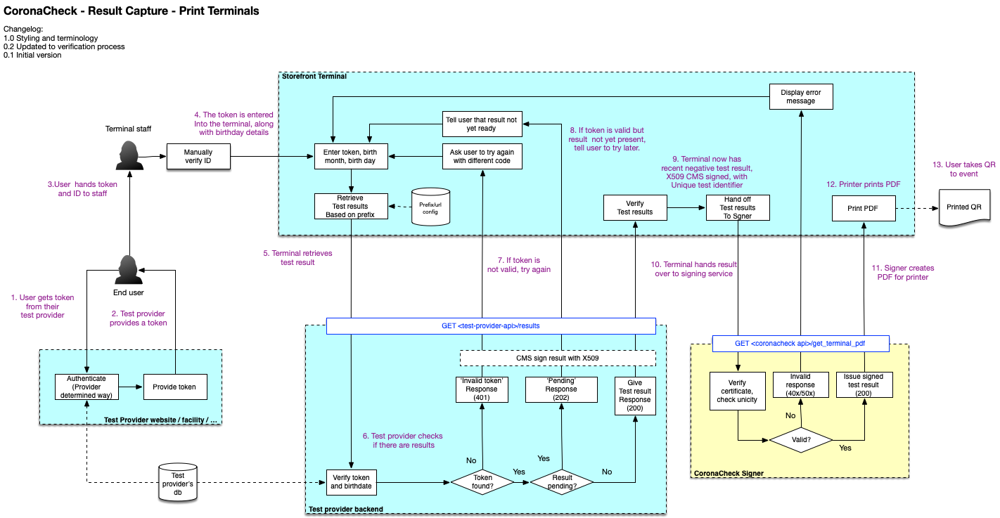
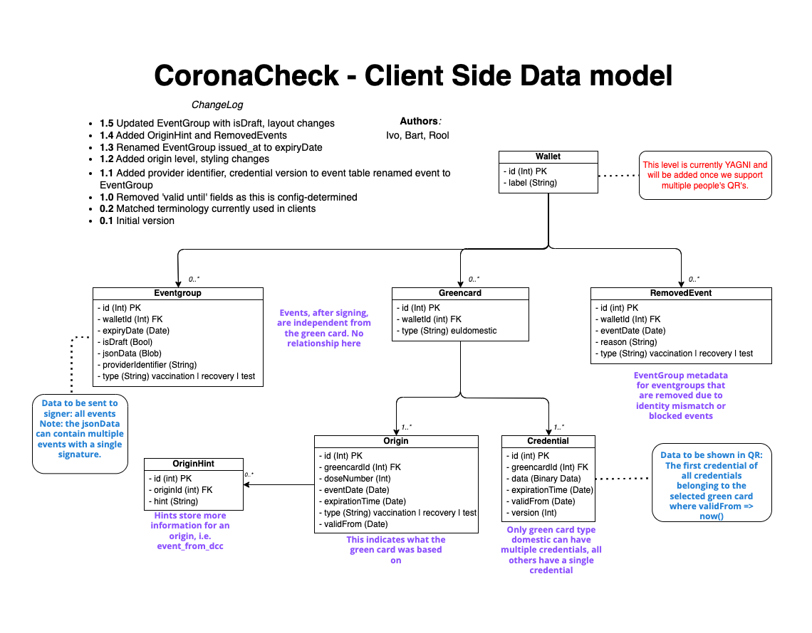

# CoronaCheck - Solution Architecture

**Version: 2.0**

# Introduction

Early 2021 the Dutch Ministry of Health, Welfare and Sport commissioned a project team to experiment with the technical possibilities surrounding a 'verifiable test result' that would let indiduals prove the fact that they have recently tested negative for COVID-19. The app, later dubbed 'CoronaCheck', is now available through the app stores and in use for negative tests. Later the team was tasked with enhancing the CoronaCheck platform to support vaccinations, recovery certificates and to provide interoparability with the European Digital COVID-19 Certificate (DCC). Whether or not vaccinations and recovery certificates will be actually used, is a policy decision. This document only describes HOW such a system should be build, not IF or WHY.

This document describes the functional and technical architecture of the CoronaCheck ecosystem. 

The document also describes the privacy and security aspects associated with the use cases for a citizen being able to prove vaccination or the veracity of a negative test result. 

In particular, the risks and mitigations are explored for both paper-based and digital versions of possible implementations for a proof of vaccination or negative test.

This document explores the realm of possible technical implementation options and describes the technical implementation that was chosen. As such, this interplay defines the envelope within which realistic solutions are likely to fit.

This document is work in progress and will be adjusted during the project. Given the nature of the project, this specification, its requirements and the solution as a whole should not be considered 'final' but a continuous work in progress. 

# Table of contents

- [CoronaCheck - Solution Architecture](#coronacheck---solution-architecture)
- [Introduction](#introduction)
- [Table of contents](#table-of-contents)
- [Requirements](#requirements)
  * [Design Input](#design-input)
  * [General Guiding principles](#general-guiding-principles)
  * [Functional Requirements](#functional-requirements)
  * [Non-functional Requirements](#non-functional-requirements)
- [Key characteristics](#key-characteristics)
  * [Privacy by design](#privacy-by-design)
  * [Open Source](#open-source)
- [High Level Architecture](#high-level-architecture)
  * [Concept](#concept)
  * [Terminology](#terminology)
  * [Solution](#solution)
  * [Protocol](#protocol)
- [Flows](#flows)
  * [Flow 1: Retrieving events via DigiD](#flow-1--retrieving-events-via-digid)
  * [Flow 2: Retrieving events via token](#flow-2--retrieving-events-via-token)
  * [Flow 3: From event to proof](#flow-3--from-event-to-proof)
  * [Flow 4: Printing a corona access card](#flow-4--printing-a-corona-access-card)
  * [Flow 5: Test result print service](#flow-5--test-result-print-service)
- [Security & Privacy](#security---privacy)
  * [Guiding principles](#guiding-principles)
  * [Overview](#overview)
  * [Attack Surface Minimisation](#attack-surface-minimisation)
  * [Data cleanup](#data-cleanup)
    + [Backend cleanup](#backend-cleanup)
    + [Apps cleanup](#apps-cleanup)
  * [App/Device Verification](#app-device-verification)
- [Backend](#backend)
  * [Data model](#data-model)
  * [Third Party Backends](#third-party-backends)
  * [Workers](#workers)
- [App Considerations](#app-considerations)
  * [Technology choices](#technology-choices)
  * [Data Model](#data-model)
  * [Native vs hybrid development](#native-vs-hybrid-development)
  * [Lifecycle Management](#lifecycle-management)
- [Changelog](#changelog)

# Requirements

The requirements for this project are derived from various brainstorm sessions and input from various stakeholders. We seek to explore the possibilities and limitations of technology to provide society with the ability to use a proof of vaccination / negative test result or recovery certificate to open up certain activities.

## Design Input

We are building the requirements of the first version on a problem domain, in an agile process in close cooperation with the design team. The designs in the design repository (https://github.com/minvws/nl-covid19-coronacheck-app-design) and this solution architecture together reflect the outcome of this agile process.

## General Guiding principles

In addition to the requirements, we have defined a number of guiding principles that a solution must adhere to. This means that this project has a number of key contextual requirements that drive or otherwise define the architecture or are used as a benchmark or implementation guideline:

* [Tijdelijke wet Coronatoegangsbewijzen](https://www.eerstekamer.nl/wetsvoorstel/35807_tijdelijke_wet)
* [Gezondheidsraad - Testbewijzen voor SARS-CoV-2: ethische en juridische voorwaarden](https://www.gezondheidsraad.nl/documenten/adviezen/2021/01/14/testbewijzen-voor-sars-cov-2-ethische-en-juridische-voorwaarden)
* [Gezondheidsraad - Ethische en juridische afwegingen COVID-19-vaccinatie](https://www.gezondheidsraad.nl/documenten/adviezen/2021/02/04/ethische-en-juridische-afwegingen-covid-19-vaccinatie)
* [Baseline Informatiebeveiliging Overheid 1.04](https://bio-overheid.nl/media/1400/70463-rapport-bio-versie-104_digi.pdf)
* [Algemene Verordening Gegevensbescherming (AVG)](https://autoriteitpersoonsgegevens.nl/sites/default/files/atoms/files/verordening_2016_-_679_definitief.pdf) 
* [Handreiking Mobiele App Ontwikkeling en Beheer 3.0](https://www.noraonline.nl/images/noraonline/a/a5/Handreiking_Mobiele_App_3.0.pdf) 
* [Web Content Accessibility Guidelines 2.1](https://www.w3.org/TR/WCAG21/)
* [NCSC beveiligingsrichtlijnen voor webapplicaties](https://www.ncsc.nl/documenten/publicaties/2019/mei/01/ict-beveiligingsrichtlijnen-voor-webapplicaties)
* [NCSC beveiligingsrichtlijnen voor mobiele apps](https://www.ncsc.nl/documenten/publicaties/2019/mei/01/ict-beveiligingsrichtlijnen-voor-mobiele-apps)

## Functional Requirements

The main requirement is the ability to provide a *verifiable* proof of vaccination, negative test or recovery from COVID-19 to a 'verifier'. This means that someone can show a test result to prove that they are not infected with COVID-19. The 'verifiable' part means that the result is cryptographically secured in such a way that a verifier can reasonably rely on the presenter presenting a proof of an actual negative result (without having to identify the user, nor to see their test result details).

## Non-functional Requirements

From a privacy by design principle, we want to disclose as little as possible. This means that a verifier can not even establish whether a person was vaccinated, or instead has taken a test to prove that they test negative for Corona. Therefor we do not use the term 'vaccination proof' or 'vaccination proof', but use the word that was used in legislation: a 'coronatoegangsbewijs' (corona access pass). 

We have identified the following non-functional requirements:

1. The solution should be usable by a large portion of the Dutch population. 
2. This means, among other things, that a corona access pass is ideally not limited to people who own a smartphone. During the project we should explore possibilities for non-digital alternatives.
3. For privacy reasons, a corona access pass should be untraceable. This means that a corona access pass is not traceable to an actual person (while still maintaining the ability to reasonably assess that the pass belongs to the person showing it).
4. It should also be 'multi-show unlinkable'. This means that if the user shows a corona access pass at two different locations, the verifier should not be able to derive that the 2 scans belong to the same user.
5. The previous bullet also applies to the issuer, subsequent events should not be linkable by the issuer either.
6. No personal details other than the data required to establish veracity of the corona access pass and a limited set of credentials to bind the result to a specific person (e.g. part of birthdate, initials) should be part of the corona access pass.
7. A negative test result should NOT imply that someone is *positive*. It implies only a *negative* result. Absence of a valid negative result could mean the user has tested positive, but could also mean the user was not tested at all. It is not relevant for a verifier to know the distinction.
8. A corona access pass should be time-limited, and the time limit should be remotely configurable to match epidemiological circumstances (e.g. the incubation time of the most prevalent strain of the Corona virus.)
9. The corona access pass should not have a history. After the result expires, it should be deleted.
10. An end user app must not rely on an online connection during verification. Circumstances may be such that network coverage is limited and Wi-Fi is not available (e.g. a remote festival venue, or a mall with limited cell network coverage)
11. Likewise, the verifier app must not rely on an online connection during verification either. 
12. A connection may however be required to prepare the apps for verification (prior to the verification in the field).
13. The ability must exist to disable the app if circumstances require termination of result verification (e.g. the end of the pandemic)
14. The ability must exist to determine if the use of corona access pass verification is proportional and allowed. This should be enforced either as part of the solution, or as part of legislation.
15. The solution should be build with scalability in mind, so it can be developed into a production-ready solution that can be deployed nationwide.

The solution should offer reasonable protection against abuse by implementing, among other things:

16. Protection against replay attacks (showing the same proof twice, e.g. by handing over your phone to someone else)
17. Protection against pregeneration attacks (QR codes generated by a hacker and distributed on a website)
18. Protection against false event injection (e.g. a user generating proof of a negative result without an actual test)
19. Protection against identity theft (showing the result of someone else)
20. Protection against forgery (someone faking an event and/or faking/abusing issuer signatures)
21. Protection against reverse engineering of the protocol. In fact, the protocols are open and the code should be open souce. Security should be derived from cryptographic solidity and not rely on security by obscurity.

# Key characteristics

## Privacy by design

For the app we follow a Privacy by Design approach. This means:

* We will not collect more data than necessary. 
* Data that we do collect is protected with appropriate measures
* We apply end-to-end security

## Open Source

All source code will be made available on the [Ministry's GitHub account](https://github.com/minvws).

# High Level Architecture

## Concept

The concept for CoronaCheck consists of the following components:

1. An app that allows users to show a verifiable test result after a negative test, a proof of vaccionation or a proof of recovery.
2. A fallback to show that same proof in a non-digital alternative.
3. An app that allows verifiers to verify the authenticity of a test result.
4. A backend that the end user app will use to retrieve a cryptographically secure, verifiable, document attesting a negative test, vaccination or recovery.
5. A backend that the verifier app will use to receive authorization to perform scans.
6. Backends of suppliers that will supply or verify negative test results, vaccitions or recovery statements.

## Terminology

Throughout this document we use a number of core concepts. To get an understanding of what's what, here is a short explanation of the most important terms:

* A *verifier* is the person/entity that wants to verify test results (e.g. the owner of a venue).
* An *agent* is the person that performs the actual verification (e.g. a bouncer at the door)
* An *issuer* is the provider of certified test results (e.g. a health authority)
* A *citizen* is a person who was tested and wants to enter a venue.
* The *holder* is the citizen that is the legal holder of a test result.

## Solution
The following diagram depicts the high level architecture of the solution. The diagram can best be interpreted by starting at one of the user icons and following their actions across the system. In later chapters of this document we will detail some of these flows in separate diagrams in more detail.

We want to avoid a 'central storage' of test results / vaccinations / recoveries. This is why we 'federate' the actual verification of test result to the original provider of the test result (issuer). In the solution we initially included a central storage for suppliers that have no other way to deliver test results, but this was highly undesirable and has been dropped from the solution to fully support the decentralized model.

## Protocol

For the solution we will adopt a protocol that is comparable in nature to the [Verifiable Credentials](https://www.w3.org/TR/vc-use-cases/) protocol by the W3 consortium. We will initially investigate the Idemix cryptographic suite, because it by design has properties such as multi-show unlinkability. The protocol could be made compatible with the W3 Verifiable Credentials implementation.

We will initially not use the standardized 'Verifiable Presentation' data format, because we need a small enough data/communication size, so that the verifiable test result will fit inside a scannable QR code. (We will conduct experiments to determine scannability of QRs of various sizes on various devices in various conditions - e.g. an older Android phone in low lighting conditions with a smudged screen.)

# Flows

This chapter describes the core flow that we are following, which is derived from the requirement, UX research and various discussions with the team.

## Flow 1: Retrieving events via DigiD

The following diagram describes how the solution would retrieve a negative test result, vaccination or recovery statement (together called an 'event') from a provider that tracks the data based on a person's BSN. In this case we let the user login via DigiD, and use that to retrieve events from the providers:

The login proces will be performed by making use of the ToegangVerleningService (TVS), a DigiD frontend specifically aid at health applications. The detailed login flow is described by this flow diagram:

## Flow 2: Retrieving events via token

The following diagram describes what the flow looks like for third parties where we can't retrieve the test result via BSN/Digid check. These parties provide their customers with a 'token', that can be used to retrieve the result. This example uses a test result, but the process could be similar for vaccinations or recoveries.

In this scenario the digid login has been replaced by a token mechanism. A user might still have to login (via digid or otherwise) at the test provider, to obtain access to the necessary token.

The following diagram details how this token flow works in detail for test results. Note that the 'login on the test provider site' is just an example, as how this part of the flow works is entirely up to the test provider.

## Flow 3: From event to proof

Once we have retrieved one or more events (vaccinations, test results, recovery statements) for a user, the CoronaCheck ecosystem will convert those events to 'proofs'. There are 2 types of proof:

* The EU Digital COVID-19 Certificate (DCC) QR for international travel between EU countries
* An NL domestic QR for access to events

Although the EU DCC could theoretically be used for access to Dutch events, we prefer to use the NL domestic QR, as it offers more privacy. A detailed design expaining these privacy aspects can be found in the document [Privacy Preserving Green Card](Privacy Preserving Green Card.md).

The following diagram describes how we get from the events to a proof that can be scanned:

A rule engine, fed with rules set by policymakers, will determine how certain events will lead to a proof. Some events may only lead to a domestic QR, others only to an EU QR, some may lead to both.

The detailed process of receiving the events and generating a signed proof, is described using the following diagram:

## Flow 4: Printing a corona access card 

For citizens who do not posess a smartphone or who do not wish to use the app, a browser version is envisioned where citizens can print the card on a printer at home. It should be noted that the paper version offers slightly *less* privacy features, for example a static QR on a paper is linkable, as opposed to the QR in the app that rotates every few minutes. Also, the paper version contains the initials of the holder (to be able for a holder to distinguish between the papers of themselves and their family members), whereas in the app version these are only visible once scanned, in the verifier app. For privacy concerned citizens it is therefore recommended to prefer the app over the paper version.

The following diagram describes the home print flow. It is very similar to flow 2. Although the diagram only depicts the token flow for home printing, there will also be a way to retrieve events in the home print flow using DigiD. It is so similar to the existing flows that making the combination of flow 1 and 4 is left as an exercise to the reader.

## Flow 5: Test result print service

For citizens who do not have or want to use the app, but also have no means to print the test proof, we have envisioned a way to do printing from a public terminal (e.g. in a store front). This flow only supports token based test results, not vaccinations or recovery certificates. The following diagram depicts this flow from a user perspective:

A notable difference with the other flows is that the verification code by SMS has been replaced by an ID check. This is to ensure that even if the citizen does not posess a mobile phone that can receive SMS messages, it is possible to print the proof. Printing is currently based on the token that is used in the third party flow. An alternative solution for GGD results (which are based on digid, which can't be used at the print terminal) should be considered, which could encompass the ability to retrieve a token for GGD results.

The following diagram is the complete flow diagram for this flow:

# Security & Privacy

## Guiding principles

* We provide as little data/knowledge about the user to anyone, including our own backend.
* If we can move logic from a server to an app, to preserve privacy, we will do so, even if that means more work in the app and less work in the backend.
* We try to avoid risks by federating certain functionality to the test vendors (e.g. we prefer to verify the result at the vendor, rather than storing results in a central database.)

## Overview

The details surrounding the security and privacy implementation of the app is laid out in the document [‘Security Architecture’](Security Architecture.md). 

## Attack Surface Minimisation

We practice 'attack surface minimisation' to reduce risks. This means we pay attention to the following:

* No more API calls than necessary for the operation of the app (no exposure of generic REST endpoints).
* No more fields in input/output than necessary (calls will provide specific answers instead of generic entities).
* Internal / machine to machine API calls separated from public / app to backend API calls.
* Where possible, deliver data via push and/or queueing mechanisms between APIs instead of via pull.

## Data cleanup

We don't want to keep data around longer than necessary. Therefor we have defined a few rules we apply for data cleanup:

### Backend cleanup

* Test results that are no longer valid should be cleaned up on a daily basis.

### Apps cleanup

* Test results are deleted after they have become invalid. Since it is technically difficult to delete items when the app is not running, the app will remove the data the first time the app starts after the data has expired.

## App/Device Verification

This part is taken directy from the CoronaMelder architecture, and we follow the route we have taken there:

The Google Reference Implementation of a backend for exposure notification suggests the use of DeviceCheck (iOS) and Safetynet Attestation (Android) to validate if a request comes from a genuine android device and/or from the official app:

* [https://github.com/google/exposure-notifications-server/blob/master/docs/server_functional_requirements.md](https://github.com/google/exposure-notifications-server/blob/master/docs/server_functional_requirements.md)

The documentation for DeviceCheck and Safetynet Attestation can be found here:

* [https://developer.apple.com/documentation/devicecheck](https://developer.apple.com/documentation/devicecheck)

* [https://developer.android.com/training/safetynet/attestation](https://developer.android.com/training/safetynet/attestation)

We have decided not to apply these platform specific checks. First, it relies on a server API at Apple and Google, which can be down and could be a privacy risk.

Second, the Android Developer blog states: 

"*In other words, not all users who fail attestation are necessarily abusers, and not all abusers will necessarily fail attestation. By blocking users solely on their attestation results, you might be missing abusive users that don't fail attestations. Furthermore, you might also be blocking legitimate, loyal customers who fail attestations for reasons other than abuse*" (NOTE:  https://android-developers.googleblog.com/2017/11/10-things-you-might-be-doing-wrong-when.html)

The safetynet attestation documentation further states about attestation failure: *"Most likely, the device launched with an Android version less than 7.0 and it does not support hardware attestation. In this case, Android has a software implementation of attestation which produces the same sort of attestation certificate, but signed with a key hardcoded in Android source code. Because this signing key is not a secret, the attestation could have been created by an attacker pretending to provide secure hardware"* (NOTE:  https://developer.android.com/training/articles/security-key-attestation)

This leads us to believe that when applying these checks, we introduce risks and dependencies while not gaining a substantial amount of security.

# Backend  

## Data model

The solution does not consist of a central database. A citizen retrieves their test result directly from the test provider (who use their own data model). The app then hands the result off to a signing service, which verifies the result signature, and converts it to a CL signed test result. This result is not centrally stored.

To avoid test proofs from being handed out more than once, the `unique` field from the test result is hashed and stored in cache for a limited time. Currently this time is set to the maximum test validity + 1 day. 

## Third Party Backends

The CoronaCheck apps retrieve their event data from third party backends. Although each party is responsible for their own architecture, we defined a set of protocols that these parties must implement in order for the apps to be able to retrieve data.

There are currently 2 protocol documents, documented in the docs/ directory and written towards these third parties:

* [Retrieving events by DigiD](../docs/providing-events-by-digid.md)
* [Retrieving events by Token](../docs/providing-events-by-token.md)

## Workers

So far we have identified no workers.

# App Considerations

## Technology choices

* iOS app: Native Swift / MVVM based architecture. Baseline iOS 11+.
* Android app: Native Kotlin / MVVM based architecture. Baseline Android 5+.
* Core backend services: written in dotnet core, hosted in a container based environment (Docker containers).
* BFF for apps: PHP/Python/etc, using a commonly used framework. Or: dotnetcore (to potentially reuse some coronamelder code).
* Any necessary web portals: PHP 7/Laravel with a VueJS frontend (to potentialy reuse GGD Contact portal effort).
* Queing and caching mechanisms: Redis (with cluster/sentinel).
* Database: Postgresql (to be able to use built in encryption mechanisms) (TODO: Or MS SQL if we want to reuse CoronaMelder code/tooling?).

## Data Model

Although the CoronaCheck solution consists of decentralized databases, we need a way to store event/access card data inside the apps. To store the data consistently between Android and iOS, both platforms use the same datamodel. The data model for the apps is outlined below:

## Native vs hybrid development

Mobile apps will be implemented as native applications, with Swift as the language used for iOS development and Kotlin for Android development.

We have carefully considered whether to do native development or use a cross platform technology, and the following arguments were leading:

* There are no requirements or constraints that dictate the use of cross platform tools.

* The available development team has sufficient capability in native app development.

* It is expected that, should we need help from Google or Apple to resolve issues while implementing this app, they can do so more efficiently if we use the development stack provided by the vendors.

* In order to ease [security] code-reviews and thus keeping them accessible to a wider audience, it is prudent to keep the app's stack and usage of programming paradigms as vanilla and lean as possible.

## Lifecycle Management

Apps run on the user’s device and updates require a review process that is not entirely under our control. To mitigate these factors that are outside our control, apps should implement a form of lifecycle management. This includes the following features:

* Configuration values or content that are expected to change should be retrieved from a server.

* Apps should offer a ‘forced upgrade’ (i.e. if a new version is available that fixes a critical bug, it should be possible to force the user to upgrade). 

# Changelog

2.0

* Added vaccination and recovery certificate flows
* Added EU interoparability.
* Removed obsolete / incomplete / orphaned documentation.

1.0

* Renamed the signer service to 'CoronaCheck Signer Service'
* Added home print flow
* Added terminal print flow
* A word on cleanup of data in the apps

0.2

* Replaced proxy service with a signer service 
* Added third party test result collection 
* Updated flow diagrams

0.1

* initial draft

# Acknowledgements

<small><i><a href='http://ecotrust-canada.github.io/markdown-toc/'>Table of contents generated with markdown-toc</a></i></small>
