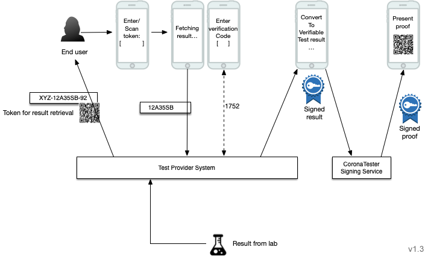

# Providing Vaccination / Test / Recovery by retrieval code

** IMPORTANT **

  >
  >  ☢️🚧 This is the upcoming 3.0 version of the protocol, which was enhanced with EU and vaccination support. 
  >  Current commercial test providers are still on version 2.0 of the protocol. The 2.0 version is tagged and can be found here:
  >  https://github.com/minvws/nl-covid19-coronacheck-app-coordination/blob/test-provider-protocol-2.0/docs/providing-test-results.md
  > 

* Version 3.0.1
* Authors: Ivo, Nick

In the CoronaCheck project we have implemented a means of presenting a digital proof of a negative test result, vaccination or recovery. This document describes the steps a party needs to take to provide test results or vaccination events that the CoronaCheck app will use to provide proof of vaccination/negative test/recovery.

## Contents

- [Providing Vaccination / Test / Recovery by retrieval code](#providing-vaccination---test---recovery-by-retrieval-code)
  * [Overview](#overview)
    + [Retrieval from the CoronaCheck app](#retrieval-from-the-coronacheck-app)
    + [Retrieval from print terminals](#retrieval-from-print-terminals)
  * [Requirements](#requirements)
  * [Distributing a test token](#distributing-a-test-token)
    + [Analog Code](#analog-code)
    + [QR Token](#qr-token)
    + [Deeplink](#deeplink)
    + [Token ownership verification](#token-ownership-verification)
  * [Exchanging the token for a test result](#exchanging-the-token-for-a-test-result)
    + [Request as received by the endpoint.](#request-as-received-by-the-endpoint)
    + [Returning a 'pending' state](#returning-a--pending--state)
      - [Poll tokens](#poll-tokens)
      - [Poll delay](#poll-delay)
    + [Requesting owner verification](#requesting-owner-verification)
    + [Returning a test result](#returning-a-test-result)
    + [Response payload for invalid/expired tokens](#response-payload-for-invalid-expired-tokens)
    + [Token retention](#token-retention)
    + [Performing terminal verification](#performing-terminal-verification)
    + [Error states](#error-states)
  * [Initial normalization](#initial-normalization)
  * [Signing responses](#signing-responses)
    + [Obtaining a signing certificate](#obtaining-a-signing-certificate)
    + [Signature algorithm](#signature-algorithm)
    + [Including the signature in the response](#including-the-signature-in-the-response)
    + [Signature verification](#signature-verification)
    + [Command line example](#command-line-example)
    + [More sample code](#more-sample-code)
    + [Governance and the digital signature of the test result](#governance-and-the-digital-signature-of-the-test-result)
- [Implementation validation process](#implementation-validation-process)
- [Security and privacy guidelines](#security-and-privacy-guidelines)
- [Appendix 1: Example implementations of X509 CMS signing](#appendix-1--example-implementations-of-x509-cms-signing)
- [Appendix 2: Validating the signing output](#appendix-2--validating-the-signing-output)
- [Appendix 3: OpenAPI specification of endpoint](#appendix-3--openapi-specification-of-endpoint)
- [Appendix 4: Available Test Types](#appendix-4--available-test-types)
- [Appendix 5: Test sets](#appendix-4--test-sets)
- [Changelog](#changelog)

## Overview

The process is designed in such a way that privacy is perserved as much as possible, while preventing abuse of the system. Mitigating measures have been designed to prevent a wide range of attacks. 

The following diagram describes a high level overview of the result retrieval process:

### Retrieval from the CoronaCheck app

The CoronaCheck Android and iOS apps, and the web version (intended for desktop use / home printing), use the following flow:



Although the picture depicts a negative test result, the process is the same for vaccination and recovery events.

## Requirements

In order to be able to deliver test results or vaccination events for CoronaCheck, a test provider MUST do the following:

* Implement a mechanism to distribute a `token` in the form of a QR or `code` to the citizen that can be used to collect a negative result. 
* Provide one endpoint:
    * An endpoint that an app can use to retrieve a test result on behalf of the citizen, e.g. https://api.acme.inc/resultretrieval, according to the specs laid out in this document.
* Obtain an x509 PKI-O certificate for CMS signing responses (from a private PKI-O root).
* CMS sign responses using the x509 certificate.
* Obtain another x509 PKI-O certificate for TLS/SSL pinning (public PKI-O root)
* Provide the public key of the CMS X509 signing certificate to the CoronaCheck team so that signed results can be verified against the certificate.
* Provide the public key of the X509 TLS/SSL certificate so the apps can perform TLS/SSL pinning against the endpoint.
* Require an out of band ownership verification of the request if the event is handed out in an unsupervised manner (see details in next chapter).

## Distributing a token

After a user has taken a test, and the result is negative, the party should supply the user with a token. There are multiple ways to communicate the token to the user, and multiple steps in the process where this can take place, but it must be provided *after* the user's test result is determined to be negative.

Similarly, if a user got vaccinated, a token can be handed out after the vaccination was registered.

For security reasons the token must be at least 10 characters long. It must be randomly generated and should not be predictable or derived from any identifier or code that was previously communicated to the user (e.g. do not use a booking code directly as a token for a negative result).

Our recommendation is to provide the token to the user in the form of a QR code. The CoronaCheck app is designed to work with QR codes and provides the user the ability to scan a QR code containing their test token. 

### Analog Code

For manual entry, the token can be wrapped in a code that consists of the `providerIdentifer`, `token`, checksum, and code version. It should look like this:

```
XXX-YYYYYYYYYYYYY-ZV
```

Where:
* XXX is a 3-letter identifier that is unique to the test provider and assigned by CoronaCheck. It tells the app which endpoint to use, which keys etc.
* YYYYYYYYYYYYY is a token of arbitrary length. The token should be sufficiently large to protect against brute-force attacks, while remaining short enough to be able to perform manual entry. (see the Security Guidelines later in this document for additional guidelines.)
* Z is a checksum to help avoid typing mistakes and to put up a small barrier for the apps to only pass tokens to an endpoint if a sanity check is performed using the check digits. This helps avoid hits on your endpoint by presenting invalid tokens.
* V is the code version that tells the app how to interpret the code. It should currently always be 2.

To ensure the code can be provided orally to the user (e.g. by phone), and to allow the user to write down the code, only the following subset of 23 characters should be used to generate tokens:

```
BCFGJLQRSTUVXYZ23456789
```

This set is optimized to avoid confusion between visually similar characters, e.g. 0 (zero) vs O (letter), as well as orally similar sounding letters. 

The code ( prefix, token and checksum/version) matches the following regular expression pattern:

```
^[A-Z0-9]{3}-[A-Z0-9]+-[A-Z0-9]{1}[2-9]{1}$
```

The checksum is defined as the Luhn mod-N for alphanummerics; where the codepoints are as per the allowed set of characters ```BCFGJLQRSTUVXYZ23456789```; with the B assigned a 0 and the 9 the number 22.

Note that the version number (2) is at the end of the string; this is an anti-pattern; but conscious choise; these are to be human readable/entered strings that would look odd starting with (always the same) number. Also note that the 'XXX-' allows for a future 'Z-XXX-' or 'ZXXX-' type of start.

### QR Token

When providing the code through a QR code, the CoronaCheck App will be able to scan the token using the device's camera. The app will look for the following content:

```javascript
{
   "protocolVersion": "3.0",
   "providerIdentifier": "XXX",
   "token": "YYYYYYYYYYYYY",
}
```

The token should use the same character subset as the oral codes (as it's common to provide the manual code as an alternative to scanning the QR, in case the user sees the QR on the same device). 

### Deeplink

When providing the token via a website that the user can visit using the device where CoronaCheck is installed, the token can be directly loaded into the CoronaCheck app by utilizing the app's deeplink functionality. To use the deeplink, the token should be wrapped inside the same code that the manual entry uses (XXX-YYYYYYYYYY-ZV) The deeplink should be constructed as such:

```https://www.coronacheck.nl/app/redeem#XXX-YYYYYYYYYYYY-ZV```

If a user does not have the app installed, the URL will take the user to the CoronaCheck website, where they can find download links to download the app. If the user does have the app, this URL will automatically open the URL and fetch the test result using the token. 

Note the use of the ```#``` in the URL. By using an anchor the token is not leaked to the CoronaCheck website when the user does not have the app installed. 

### Token ownership verification

If the token can be securely transferred to the user (e.g. by scanning a QR code in the test facility right after having confirmed identity, under supervision of staff), it is not necessary to require ownership verification. In most circumstances however, ownership should be verified upon entering the test result. Ownership verification is performed by sending a one time code to the user's phone per sms or per email, at the moment the user enters the token into the app. Although this doesn't guarantee for 100% that the result won't be passed to someone else, it now requires a deliberate act of fraud, instead of just 'handing over a voucher'. 

The process of providing a one time code sent via sms/e-mail is familiar to users who have used Two Factor Authentication mechanisms. It is important to note that the scheme documented in this this specification is not a true 2FA schema. In a true 2FA schema two distinct factors should be used, whereas in our case there is only one distinct factor - both the token and the verification code constitute 'something you have'. 

Verification codes must be numeric and 6 digits. 

Note: Verification codes will only be used when the user uses the app. For terminal flows this verification is replaced by an ID check.

## Exchanging the token for a test result or vaccination event

Once the token is scanned / read / entered in the app, CoronaCheck will try to fetch the result.

The provider should provide an endpoint that allows the user to collect this result using the token provided in the previous step:
* The CoronaCheck end user app will fetch the result, using the token, directly from the test provider backend. This flow should include the verification step (using a verification code sent to the user's device) described earlier. 
* The CoronaCheck website for home printing will use the exact same endpoint.

Depending on where in the process the token was supplied, and depending on when the user enters it in their app, there can be 3 distinct responses:

* A result is not yet available (the request should be retried later)
* A result is available but requires verification (a verification code has been sent and should be retried with the code)
* A result is available (the negative test result is included in the response)

Both states will be detailed below.

### Request as received by the endpoint.

The detailed specification of the endpoint is provided in appendix 3.

The Authorization header will contain a Bearer token which consists of the `token` (YYYYYYYYYYYYY) part of the `code`.

In common CURL syntax it looks like this when the request comes from the app or website:

```
curl
  -X POST
  -H "Authorization: Bearer YYYYYYYYYYYYY"
  -H "CoronaCheck-Protocol-Version: 3.0"
  -d { "verificationCode": "12345"}
  https://provider-endpoint-base-url
```

The call will contain a body with a `verificationCode` obtained from the ownership verification process (see further down on verification details). If your facility employs supervised scanning of a QR and doesn't require ownership verification, the app will omit this body. 

Notes:

* The useragent will be anonimized.
* HTTP POST is used instead of a GET to aid in preventing logging/caching of the token or code.

### Returning a 'pending' state

In the case of test results, a token must *only* be provided to users who have a negative test result. However, to accommodate a small set of providers who have a delay (caused by caching/batching) in publishing the result for consumption by the app, we support returning a 'pending' state. This indicates to the app that the result is not yet available, and the app should try again in the specified time frame. Note that this approach is *not recommended* as the user already knows they have a negative result, but are still unable to retrieve it. 

The HTTP response code is: 202

The response body would look like this (for both the app and terminal endpoints):

```javascript
{
    "protocolVersion": "3.0",
    "providerIdentifier": "XXX"
    "status": "pending",
    "pollToken": "...", // optional
    "pollDelay": 300, // seconds, optional
}
```

Where: 

* `protocolVersion` is the version of the protocol used. This helps the app interpret the QR correctly. This should match the version of the protocol implemented.
* `providerIdentifier` is the 3-letter identifier of the test provider, as supplied by the CoronaCheck team.
* `status`: Should be `pending` or `complete` (lowercase), to indicate that a result is included or not.
* `pollToken`: An optional token of max 50 characters to be used for the next attempt to retrieve the test result. If no pollToken is provided, the next attempt will use the original token provided by the user.
* `pollDelay`: An optional delay that tells the app the minimum number of seconds to wait before checking again. When present - the callee MUST adhere to this delay (to give the origin server thundering herd control). If the test process is sufficiently predictable, this can be used to indicate to the user when their result is expected. If no pollDelay is provided the app will try again a) after 5 minutes (if the app stays in the foreground), b) if the user opens the app from the background and more than the 'pollDelay' amount of seconds has passed or c) manually by means of a refresh button, pull to refresh or similar mechanism.

#### Poll tokens

The API provides support for poll tokens. If the user's test result is not known the first time your API is called, you can return a new, globally unique string (the "poll token"). The user's app will present this token the next time the service is called. By providing a new unique token for every request you make it harder for the user to attempt to load their test results into multiple telephones.

If the request provides a new pollToken in the response, then the previous `pollToken` should be kept around and valid, until the new one is seen in a request once. This ensures that when a request fails to retrieve the contents of the `pollToken`, it can retry with the previous one. Otherwise a test result could become unretrievable.

#### Poll delay

To protect backends, the minimum amount of time between requests is 5 minutes. Specifying a `pollDelay` shorter than 5 minutes will not be respected and treated as if it said 300. A longer `pollDelay` is of course acceptable.

Please note that the `pollDelay` is not guaranteed. Foreground/background activity might influence the actual time it takes between checks, and we may add a random factor for load distribution. 

### Requesting owner verification

To tighten the binding between user and test result, ownership verification should be performed when a result will be issued outside a supervised context. The server should issue a verification code to the user by ways of sms, phone or e-mail and should return a response that prompts the CoronaCheck app to ask for this validation number. 

To prompt the response, use HTTP response code: 401

The response body should look like this:

```javascript
{
    "protocolVersion": "3.0",
    "providerIdentifier": "XXX"
    "status": "verification_required",
}

```

The client can then repeat the request, but include the verificationCode body.

### Returning a test, vaccination or recovery event

When a result is available, the http response code should be: 200

And the payload should look like this:

```javascript
{
    "protocolVersion": "3.0",
    "providerIdentifier": "XXX",
    "status": "complete", // This refers to the data-completeness, not vaccination status.
    "holder": {
        "identityHash": "", // The identity-hash belonging to this person.
        "firstName": "",
        "infix": "",
        "lastName": "",
        "birthDate": "1970-01-01" // ISO 8601
    },
    "events": [
        {
            "type": "vaccination",
            "unique": "ee5afb32-3ef5-4fdf-94e3-e61b752dbed9",
            "vaccination": {
                // Vaccination record
            }
        }, // or
        {
            "type": "negativetest",
            "unique: "...",
            "negativetest": {
                // Test record
            }
        }, // or
        {
            "type": "recovery",
            "unique": "...",
            "recovery: {
                // Recovery record
            }
        }, // or
        { 
            "type": "positivetest",
            "unique": "...",
            "positivetest": { 
                // Positive test record 
            }
        }
    ]      
}
```

Where:

* `protocolVersion` indicates the version of this protocol that was used.
* `providerIdentifier`: the provider identifier as discussed earlier
* `status`: Either `pending` or `complete` (lowercase)
* `holder`: A number of personally identifiable information fields that allow verification against an ID, without revealing a full identity. 
* `events`: The container for the actual events. Although events is an array, this is purely for compatibility with [Digid based retrieval](providing-events-by-digid.md). Each code should correspond to a single event.

For the details of the vaccination, test and recovery records, see the overview at https://github.com/minvws/nl-covid19-coronacheck-app-coordination/blob/main/docs/data-structures-overview.md


### Response payload for invalid/expired tokens

Invalid or expired tokens should have the same response (this ensures that attempts to try tokens do not reveal whether they are invalid or expired). 

The http response code for an invalid token should be: 401

```javascript
{
    "protocolVersion": "3.0",
    "providerIdentifier": "XXX",
    "status": "invalid_token"
}

```

Note: both failed/expired tokens and missing `verificationCode` result in a 401 (as the request could be retried with the correct token/verificationCode). The app will distinguish between the 2 states by looking at the body.

### Token retention

A token should remain valid until the underlying record expires. Currently this is:
* 40 hours after the sample time of the underlying test result.
* One year after a vaccination event
* 180 days after a recovery event

Even when a user has already retrieved their result via a token, it should remain valid. One reason is that the user might reinstall their app and need to retrieve the result again. Another reason for this is that they need to confirm in the CoronaCheck app that this is indeed the correct result that should be converted to a QR. This process is cancelable by the user, and is not atomic (e.g. it could fail before a QR has been generated succesfully). To avoid the user ending up with neither a valid code nor a valid QR, the token should *not* be immediately removed after succesful retrieval. If the user cancels the operation and re-enters the code later, they can still retrieve their result. 

To avoid reuse of the code by multiple phones/users, the Signer Service will only sign each result a limited number of times, based on its `unique` field, so even if during the validity window the user would retrieve the result multiple times, only a few times it can be converted to a signed test result in the signing service. This is to avoid certain forms of fraud.

### Error states

If an error occurs on the server, a proper 40x or 50x response should be returned. If such an error occurs, the CoronaCheck app will ask te user to try the request at a later time.

A response body may be provided for debugging purposes, but this is optional and the app will not communicate it to the user. 

Avoid including details about your server implementation in the error body (e.g. no stack trace).

The body, if provided, should look like this:

```javascript
{
    "message": "An internal server error occured."
}
```

The following error codes will have a specific message in the app:

* 429 (too many requests) - The app will tell the user that the server is busy and will ask to try again later.
* Any other 40x / 50x errors will lead to a generic error message. 

### CORS headers 

To be able to retrieve the test result from a web browser (the web client for home printing), the following CORS headers should be present on the app token retrieval endpoint:

```
Access-Control-Allow-Origin: https://coronacheck.nl
Access-Control-Allow-Headers: Authorization, CoronaCheck-Protocol-Version, Content-Type
Access-Control-Allow-Methods: POST, GET, OPTIONS
```

For acceptance testing, the url is slightly different, so on acceptance test environments, the headers should be:

```
Access-Control-Allow-Origin: https://web.acc.coronacheck.nl
Access-Control-Allow-Headers: Authorization, CoronaCheck-Protocol-Version, Content-Type
Access-Control-Allow-Methods: POST, GET, OPTIONS
```

Notes:
* The app endpoint must respect the OPTIONS request (respond with 200 status code) that browsers will perform to check the headers. The OPTIONS request should have the same headers but no body.

## Signing responses

The app only accepts the responses if they are signed. This chapter describes the way the endpoint should sign the responses.

### Obtaining a signing certificate

Signatures should be created using a certificate from the so-called PKI-O private root. General information about PKI-O certificates can be found on [the Logius website](https://logius.nl/diensten/pkioverheid/aanvragen). 

To order a certificate you can make use of a TSP such as (in alphabetical order, without endorsing one over the other):

* Digidentity - [link to private certificate form](https://www.digidentity.eu/nl/certificates) (Note: at Digidentity a private certificate is called an SBR certificate)
* KPN - [link to private certificate form](https://certificaat.kpn.com/aanvragen/servercertificaten/private/)
* QuoVadis - [link to private certificate form](https://www.quovadissupport.nl/modules/PPSC/certificate?ts=1613133082&sc_lang=nl_nl)

(Note: the websites are maintained by their respective owners - the links may change) 

### Signature algorithm

We are using a CMS algorithm because this is widely available across a large variety of technologies. It is usable from the commandline using tools such as openssl. We may in the future provide libraries and/or off the shelf proxy containers to aid in developing an endpoint. Note however that although the CoronaCheck team may provide samples or ready to use software, the provider remains solely responsible for the test results that are handed out and remain the processor in the GDPR sense.

The signature should use an appropriate signature algorithm and padding; conformant to the current, in-force SOG-IS (https://www.sogis.eu/uk/supporting_doc_en.html) standard. Note specifically that the default padding in OpenSSL (PCSK#1.5) is not considered secure.

The signing looks like this:

```
signature = CMS(PAYLOAD_JSONBYTES, x509cert)
```

The signature must be calculated over the raw json bytes from the response stream.

Note: Add all intermediate certificates to the CMS signature (in order to establish a trust chain).


### Including the signature in the response

The signature and the payload must be wrapped inside a wrapper response. In earlier versions of this document we used a header to transmit the signature, but an CMS signature can exceed the maximum header size of some web servers / proxies.

The wrapper contains 2 fields:

* A base64 encoding of the signature, which contains the signature calculated in the previous chapter.
* A base64 encoded version of the (exact) payload.

For example:

```
HTTP/2 200 
date: Sat, 06 Feb 2021 08:52:00 GMT
content-type: application/json
content-length: 145
{
    "signature": "<base64 encoded version of the signature>",
    "payload": "<base64 encoded version of the payload>"
}
```

### Signature verification

The client app will perform the following actions when a signed response is received:

1. Base64-decode the payload to obtain the jsonbytes of the original response.
2. Base64-decode the signature
3. Check if the signature is valid for the jsonbytes of the payload
4a. If yes: parse the jsonbytes and process the result
4b. If no: refuse to use the json data and display an error 

### Command line example

See appendix 1 for more detailed examples. To try out the algorighm on a Linux commandline, you could use:

```
    openssl cms -sign -outform DER \
                -out content.sig -content response.json \
                -signer mycrt.crt
             
```    

The resulting content.sig can be base64 encoded and placed in the cms-signature header.         

The mycrt.crt is a X.509 certificate as issued to the sender by PKI-O. Full example in appendix 1.

### More sample code

More sample code for the signing method can be found in our [Github Sample Code repository](https://github.com/minvws/nl-covid19-coronacheck-tester-signature-demo)

### Governance and the digital signature of the result

Whenever a digital signature is placed - it is the signers responsibility to ensure that this signature is placed on the right data; and that they have taken appropriate steps to ensure it is not issued or distributed in error, twice or can be 'obtained' without sufficient controls.

It is the responsibility of the party fetching the data to ensure that it is connected to the right system (by means of certificate pinning and PKI-O certificate checks). 

And in B2B settings (such as the print terminals), the client may be required to provide a PKI-O client certificate to authenticate (and the provider must check validity of this certificate).

#  Implementation Validation process

This process provides both CoronaCheck and the Test Result Provider the assurance that their implementation is capable of correctly handling the test cases defined by CoronaCheck. The process is designed to be repeated on a periodic bases to ensure that implementations remain compliant with the requirements of CoronaCheck.

1. Result provider deploys their API into an acceptance environment.
2. Result provider loads the latest test set file into their database.
3. Result provider requests a validation from CoronaCheck, providing the URL to be called and their Provider code.
  * CoronaCheck team manually execute the test set.
  * CoronaCheck team provide the Result Provider with the results in the form of a report.
4. If unsuccessful, Result provider applies technical fixes and follows this process again from step 1.

The test set files are defined in [Appendix 5: Test sets](#appendix-4--test-sets).

The first version will not support the two factor authentication flow: the endpoint under test must be configured such that this check will be ommitted.

Our intention is to extend this process to include a self-service portal; this will greatly simply the validation process and allow it to be executed on demand by any test providers as part of their continous development process.

# Security and privacy guidelines

When providing endpoints for test retrieval, along with the general best practices regarding web application security, the following security and privacy guidelines should be followed:

* Do not include any personally identifiable data in responses.
* The app will not trust redirects. This means exact specification of endpoint urls, accurate to the point of trailing slashes and extensions. 
* The CMS signature should use an appropritate signature algorithm and padding; conformant to the current, in-force [SOG-IS](https://www.sogis.eu/uk/supporting_doc_en.html) standard.
* The unique identifier of the test result MUST NOT be linkable to an individual citizen, pseudonymization is required. 
* Tokens should have a lifetime of at maximum 40 hours after the sample time (see [token retention](#token-retention)
* Verification codes should have a limited lifetime of 5 minutes. 
* Properly secure endpoints against common attacks by implementing, for example, but not limited to, OWASP best practices.
* Properly secure endpoints against DDOS attacks. 
* Properly secure endpoints against brute force attacks, for example by accepting a maximum number of attempts to provide a verificationCode
* Do not log IP addresses for longer than necessary to perform normal opsec practices for preventing/combating abuse.
* Do not store IP addresses alongside test results or user data.
 
Note that this is not an extensive list and the provider is solely responsible for their own handling of the user's data according to its privacy policy.

# Appendix 1: Example implementations of X509 CMS signing

The directory 'shellscript' of https://github.com/minvws/nl-covid19-coronacheck-tester-signature-demo contains a script to generate such signatures ``sign.sh``:

    #!/bin/sh
    set -e

    if [ $# -gt 2 ]; then
	    echo "Syntax: $0 [example.json [client.crt]]"
    	exit 1
    fi
    
    JSON=${1:-example.json}
    CERT=${2:-client.crt}
    
    SIG_B64=$(openssl cms -in "$JSON" -sign \
    	-outform DER -signer "$CERT" -certfile chain.pem -binary | base64)

    JSON_B64=$(base64 "$JSON")
    cat <<EOM
    [
    	{
    		"payload": "$JSON_B64",
    		"signature": "$SIG_B64"
    	}
    ]
    EOM

along with the code needed to decode and verify this.

# Appendix 2: Validating the signing output

The directory 'shellscript' of https://github.com/minvws/nl-covid19-coronacheck-tester-signature-demo contains a script that can verify a signature and decode the json.

Its typical use is

      curl --silent 'https://api.FQDN.nl/something/config' | sh verify.sh        

when used against a PKI-Overheid.nl certificate; or 

      curl --silent 'https://api.FQDN.nl/something/config' | sh verify.sh self-signed.pem

when used against a self-signed test certificate.

# Appendix 3: OpenAPI specification of endpoint

Todo: swagger doc

# Appendix 4: Available Test Types

ID         | Name
-----------|--------
pcr        | PCR Test (Traditional)
pcr-lamp   | PCR Test (LAMP)
antigen    | Antigen Test
breath     | Breath Test

# Appendix 5: Test sets

## Test Cases File Name and Location

The test sets will be published in the coordination repository in the folder:

	`docs\resultprovider\testsets`. 

The test set files follow the following naming convention:

	RPyyyy-MM-dd-i
	
Where:

	RP = fixed text prefix
	yyyy = year, i.e. 2021
	MM = month, i.e. 04
	dd = day, i.e. 01
	i = index number

For example:

	RP2021-01-01-1.csv

The latest - and current - file is the file with the highest date and index number. This can be easily seen by sorting the files alphabetically.

## Test Cases File Structure

We will provide the data used for the test cases in the CSV format in the following structure:

Data will be delimited by the following character:

	Name: pipe, vertical line
	Character: `|`
	Unicode number: `U+007C`
	HTML code: `&#124;`
	ASCII code: 

Text file format:

	UTF-8 without BOM

Line-endings:

	LF

Fields:

	caseId
		format:
			string
		pattern:
			^[A-Z]{1}[0-9]{5}$ 
		example:
			C00001

	sampleDateTime
		format:
			string
		type:
			ISO-8601 date/time UTC to second precision
		example:
			2021-04-23T11:45:38Z
		
	fullName
		format:
			string
		pattern:
			^[^|]*$
			
	birthDate
		format:
			string
		type:
			ISO-8601 date
		example:
			2021-12-31
		
	negativeResult
		format:
			boolean
		values:
			0 = false
			1 = true
		
	testType
		format:
			string
		pattern:
			^[^|]$*$

	expectedFirstNameInitial
		format:
			string
		pattern:
			^[A-Z]{1}$
		
	expectedLastNameInitial
		format:
			string
		pattern:
			^[A-Z]{1}$
			
	expectedBirthDay
		format:
			string
		pattern:
			^1[0-9]$|^2[0-9]$|^3[0-1]$|^[xX1-9]$
		
	expectedBirthMonth
		format:
			string
		pattern:
			^1[0-2]$|^[xX1-9]$
			
	expectedSampleDateTime
		format:
			string
		type:
			ISO-8601 date/time UTC to second precision
		example:
			2021-04-23T11:00:00Z
		notes:
			The minutes and seconds must be set to zeros

Example:

	C00001|2021-04-01T10:10:10Z|Pietje Puk|1945-05-05|1|PCR|P|P|5|5|2021-04-01T00:00:00Z

# Changelog

3.0.1
* Added error code information
* Added infix to structures
* Added support for positive tests

3.0

* Added support for vaccinations and recoveries
* Removed the print terminal flow (currently not in use)

2.3.3

* Added implementation validation process
* Added specification of the test sets
* Added placeholder for the onboarding process

2.3.2

* Added missing CORS header `Access-Control-Allow-Headers: Content-Type`

2.3.1

* Added CORS headers and info on home printing.
* Added missing test types

2.3.0

* Added print terminal flow.
* Emphasize that tokens should be randomly generated.

2.2.0

* Reduced ambiguity by requiring (instead of recommending) tokens to only use the 'orally optimized subset' of token characters.
* Be more explicit about the validity of tokens.
* Clarify that tokens must only be handed out to users whose test result is negative.
* Specified the requirements of verification codes (numeric and 6-digit). 

2.1.0

* Specify [token retention](#token-retention)
* Added table of contents
* Added ability to create specimen results

2.0.0

* Replaced birthday checksum with initials/birthday day/month

1.3.0
* Document the addition of intermediate certificates to the signature

1.2.2

* Fix Checksum calculation link

1.2.1 

* Updated app name

1.2.0

* Fixed discrepancy between image and text. Added Appendix 4 with available test types.
* Rename the `uniqueId` to `unique` to clearly mark it is not a database id.

1.1.0

* Added information on how to calculate the birthday checksum
* Added info on where to obtain a PKI-O certificate. 
* Added remark about not trusting redirects to security guidelines. 
* Added remark about verification code validity. 
* Fixed documentation where negativeResult=true seemed to mean positive. 
* Changed the signature packaging to accommodate test parties that have limits on the size of http headers
* Added unique identifier to test result (to be able to check that a test result will only be offered once to the signer service)

1.0.0

* Initial version


